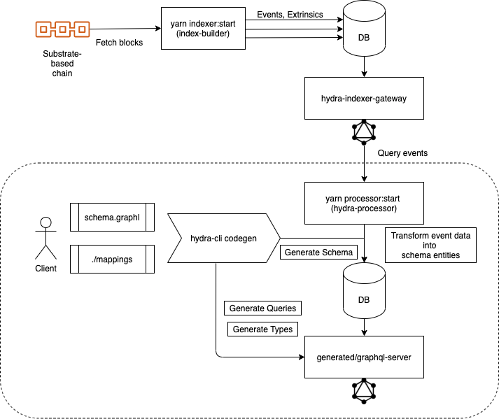

# Hydra


A Substrate query node framework. Hydra gives a smooth way to provide powerful GraphQL queries to app developers over your Substrate blockchain state and history.

## What's Hydra?

[Hydra](https://subsquid.io) is a query node for Substrate-based blockchains. A query node ingests data from a substrate chain and provides rich, domain-specific, and highly customizable access to the blockchain data, far beyond the scope of direct RPC calls. For example, expired [Kusama Treasury](https://wiki.polkadot.network/docs/en/learn-treasury) spending [proposals](https://kusama.subscan.io/event?module=Treasury&event=Proposed) are pruned from the state of the [Kusama blockchain](https://polkascan.io/kusama), so querying, say, one-year-old proposals is problematic. Indeed, one has to track the evolution of the state by sequentially applying the Treasury events and extrinsics in each historical block.

That's where Hydra gets you covered. Define your data model and the Hydra indexer will get it in sync with the chain. On top of that, you get a batteries-included GraphQL server with comprehensive filtering, pagination, and even full-text search capabilities.

## Hydra Quickstart

### Prerequisites

- Node 14.x
- Yarn

### Option 1

Clone the [template repo](https://github.com/subsquid/hydra-templatee) and follow the instructions in README. The project is ready for hacking!

### Option 2

Run

```text
$ npx @subsquid/hydra-cli@next scaffold
```

and answer the prompts. It will generate a sample project and README with setup instructions.


## Architecture one-liner

A Hydra query node ingests substrate events in a multi-step pipeline:

```text
Substrate Chain => Hydra Indexer => Indexer GraphQL gateway => Hydra Processor => Database => Query Node GraphQL endpoint
```

We recommend using a publicly available Hydra Indexer hosted by [Subsquid](https://subsquid.io).
The following Hydra Indexer endpoints are currently available and are ready to be used either in a Hydra pipeline or as a standalone API-friendly explorer.

- [Polkadot](https://polkadot.indexer.gc.subsquid.io/graphql)
- [Kusama](https://kusama.indexer.gc.subsquid.io/graphql)
- [Karura](https://karura.indexer.gc.subsquid.io/graphql)
- [Equilibrium](https://equilibrium.indexer.gc.subsquid.io/graphql)
- [Robonomics](https://robonomics.indexer.gc.subsquid.io/graphql)
- [Joystream(Sumer)](https://joystream-sumer.indexer.gc.subsquid.io/graphql)
- [Subsocial](https://subsocial.indexer.gc.subsquid.io/graphql)

Get in touch with [Subsquid](mailto:dz@subsquid.io) to get your chain indexed by Subsquid.
You can also set up a self-hosted Hydra Indexer as described in the [docs](hydra-indexer.md).

## Bird-eye overview

A Hydra pipeline has two principal components: Hydra Indexer and Hydra Processor. Hydra Indexer ingests raw data from a substrate chain. Hydra Processor transforms the raw data pulled fron the Indexer into domain-level entities defined by the user. The shape of entities is defined in `schema.graphl`. The data treansformation rules (or "mappings") are stateless Javascript functions defining how the Substrate runtime event data should be handled. The set of runtime events, event filters and other Processor settings are defined in `manifest.yml`. `hydra-cli` provides additional scaffolding and codegen tooling for running and developing a Hydra Processor tailored for the provided schema file.



## What's next?

* Explore live Hydra Indexer  [playground](https://kusama.indexer.gc.subsquid.io/graphql) and query Kusama events and extrinsics
* [Install](install-hydra.md) Hydra toolkit 
* Hydra [tutorial](quick-start.md): spin a query node in under five minutes 
* Learn how to define your own data [schema](schema-spec/) and [mappings](mappings/) to run a Hydra Indexer
* Check [FAQ](faq.md) for the most common gotchas

