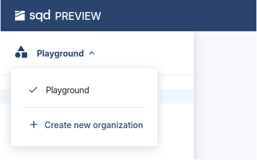
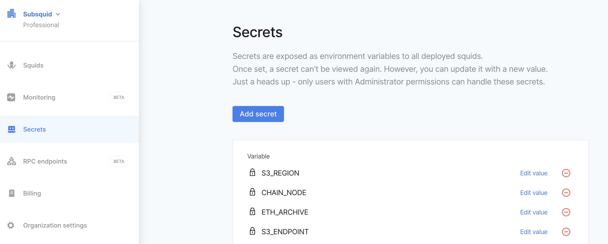
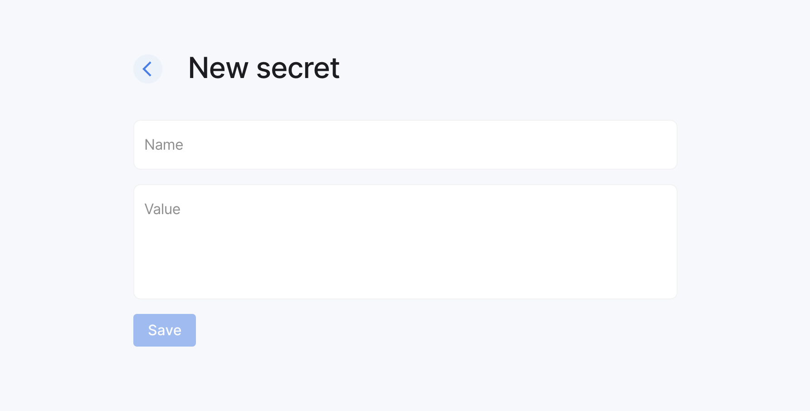

# Deployment workflow

Here we show how to deploy a production-ready indexer ("squid") to SQD Cloud. See [Development flow](/sdk/how-to-start/squid-development) and the rest of the [Indexing SDK](/sdk) section for more info on how to develop one of these.

**Pre-requisites:** Docker, [Squid CLI](/squid-cli/installation)

## 1. Prepare the squid for deployment

Make sure that the squid is ready for deployment. This includes:

- Verifying that the squid is working as expected locally.
- Ensuring that the squid is free of any major performance issues. See [Best practices](/cloud/resources/best-practices) for guidance.
- Updating the `squid.yaml` file (a.k.a. "deployment manifest") with the correct values for your use case.
- Setting up SQD Cloud secrets if necessary.

## 2. Register a SQD account

You can register a SQD account by visiting the [SQD cloud](https://app.subsquid.io). Click `Create an account` and fill in the required information, or sign in with your GitHub or Google account.

## 3. Create a professional organization

Once you're logged in, create a new [organization](/cloud/resources/organizations) and upgrade it to [professional](/cloud/resources/organizations/#professional-organizations) by attaching a valid credit card in the "Billing" tab.



You can skip this step, but then you will only be able to deploy to your account's [playground](/cloud/resources/organizations/#playgrounds). Playground squids are a trial / development solution with limited functionality; they are not suitable for use in production.

## 4. Edit the `squid.yaml` file

### 4.1. Basic configuration

First, set squid name, description, and other metadata in the [header section](/cloud/reference/manifest/#header) of the `squid.yaml` file.

If necessary, configure your [`build` options](/cloud/reference/manifest/#build) next. If the defaults - NodeJS v20 and `npm` for package manager - work for you, just create an empty `build` section.

Finally, edit the [`deploy` section](/cloud/reference/manifest/#deploy) to specify the deployment options.

The resulting configuration file may look like this:

```yaml
manifest_version: subsquid.io/v0.1
name: sample-squid

build:

deploy:
  processor:
    cmd: ["sqd", "process:prod"]
  api:
    cmd: ["sqd", "serve:prod"]
```

Note that the `processor` and `api` commands are [commands.json](/squid-cli/commands-json)-based. This is optional.

### 4.2. Using addons

SQD Cloud addons enable extra services for your squid. Enable them in the `deploy.addons` section.

#### `rpc` addon

For real time data you can use the [`rpc` addon](/cloud/resources/rpc-proxy). First, open the `RPC endpoints` tab in the SQD cloud sidebar and copy the URL of the chosen endpoint.


Add it to the `.env` file:

```bash
RPC_ARBITRUM_ONE_HTTP=<endpoint-url>
```

This allows using the Cloud RPC in local runs. To make the same endpoint available in Cloud, enable the addon in the `addons` section:

```yaml
deploy:
  addons:
    rpc:
      - arbitrum-one.http
```

To use this endpoint in your squid, set the RPC endpoint like so in `src/main.ts`:

```typescript
import { assertNotNull } from '@subsquid/util-internal'

export const processor = new EvmBatchProcessor().setRpcEndpoint(
  assertNotNull(
    process.env.RPC_ARBITRUM_ONE_HTTP,
    'Required env variable RPC_ARBITRUM_ONE_HTTP is missing'
  )
);
// ...the rest of the processor configuration
```

This configuration will use the Arbitrum RPC endpoint provided by SQD.

#### `postgres` addon

For squids that [write their data to PostgreSQL](/sdk/resources/persisting-data/typeorm) use the [`postgres` addon](/cloud/reference/pg):

```yaml
deploy:
  addons:
    postgres:
```
You should also configure the [`scale` section for the addon](/cloud/reference/pg/#scaling) when deploying to production, e.g.:

```yaml
scale:
  addons:
    postgres:
      storage: 100G
      profile: medium
```

#### `hasura` addon

If your squid [uses a dedicated Hasura instance](/sdk/resources/serving-graphql/#hasura), configure the [`hasura` addon](/cloud/reference/hasura) to supply it.

### 4.3. API scale

Squids come with a GraphQL service out-of-the-box. You can enable or disable the service by adding or removing the `deploy.api` section of the `squid.yaml` file. In the [`scale.api` section](/cloud/reference/scale/#api) you can also set the scale and number of replicas.

```yaml
deploy:
  api:
    cmd: ["sqd", "serve:prod"]
scale:
  api:
    profile: large
    # load-balance three replicas
    replicas: 3
```

This approach works if you use [OpenReader](/sdk/resources/serving-graphql/#openreader) (the default in most current examples) or [PostGraphile](/sdk/resources/serving-graphql/#postgraphile). If your squid uses a dedicated [Hasura instance](/sdk/resources/serving-graphql/#hasura) for its GraphQL needs, consult the [`hasura` addon page](/cloud/reference/hasura).

### 4.4. Processor scale

Next, set the scale of the indexer processor. See [this reference section](/cloud/reference/scale/#processor) to learn about your options.

```yaml
scale:
  processor:
    profile: medium
```

### 4.5. Dedicated deployment

[Dedicated deployment profile](/cloud/reference/scale/#dedicated) is now the default, so if it isn't explicitly disabled in your manifest you don't need to do anything.

However, if you have a `dedicated: false` in your `scale:` section (e.g. because you previously deployed your squid to a [playground](/cloud/resources/organizations/#playgrounds)) you must either erase that or replace it with an explicit
```yaml
scale:
  dedicated: true
```
**We strongly discourage using collocated squids in production,** so be sure to check.

### 4.6. The resulting `squid.yaml`

Here is an example of a `squid.yaml` file with all the options set:

```yaml
manifest_version: subsquid.io/v0.1
name: sample-squid

build:

deploy:
  addons:
    postgres:
    rpc:
      - arbitrum-one.http
  processor:
    cmd: ["sqd", "process:prod"]
  api:
    cmd: ["sqd", "serve:prod"]

scale:
  addons:
    postgres:
      storage: 100G
      profile: medium
  processor:
    profile: medium
  api:
    profile: large
    # load-balance three replicas
    replicas: 3
```

For all deployment options, check out the [deployment manifest](/cloud/reference/manifest) page.

## 5. Set any required secrets

If your squid uses any sensitive data such as a private URL or an access key, you need to store it in a [SQD Cloud secret](/cloud/resources/env-variables/#secrets). You can do this by going to the `Secrets` tab in the SQD cloud sidebar and adding the required values.





Alternatively, use [`sqd secrets`](/squid-cli/secrets).

## 6. Deploy the squid

To deploy the squid to the cloud, open `Squids` in the sidebar and press the `Deploy a squid` button in the SQD cloud.


You will be prompted to install the Squid CLI if you haven't already. Follow the instructions to install the CLI.
Next, set up your auth key as shown in the SQD cloud.
Type the squid name to be the same as in the `squid.yaml` file.

Finally, deploy the squid:

```bash
sqd deploy <path_to_squid_project_root>
```

## 7. Monitor the squid

:::tip
Take a look at [logging page](/cloud/resources/logging) for tips on emitting and reading logs.
:::

After deploying the squid, you can monitor its status in SQD Cloud. You can see the logs, metrics, and other information about the squid in the Cloud dashboard.

Open the monitoring tab in the SQD cloud sidebar to see the status of your squid.

Deployed quids are available in the `Squid` tab.


You can see memory usage, CPU usage, and other metrics in the monitoring tab. Here is an example of the monitoring tab:


## 8. Use the squid

If your squid uses a database, you'll have direct access. Take a look at the `DB access` tab of your squid's card in SQD Cloud console.

Squid deployments are organized with [slots and tags](/cloud/resources/slots-and-tags). This structure enables a rich variety of workflows, notably including [zero downtime updates](/cloud/resources/slots-and-tags/#zero-downtime-updates) of squid GraphQL APIs. We recommend that you use this workflow for all production squids.

## What's next?

- Take a look at our [pricing](/cloud/pricing).
- Learn more about [organizations](/cloud/resources/organizations) and the [slots and tags system](/cloud/resources/slots-and-tags).
- Browse the [`sqd` CLI documentation](/squid-cli) to learn how to perform common squid maintenance tasks.
  + [create or update a deployment](/squid-cli/deploy)
  + [tag a deployment](/squid-cli/tags)
  + [kill a deployment](/squid-cli/remove)
