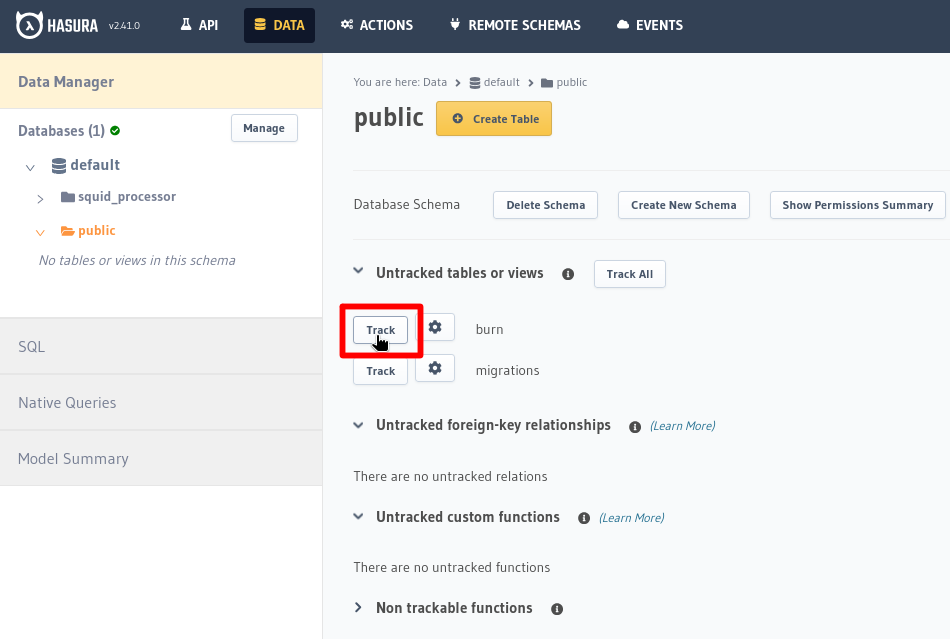
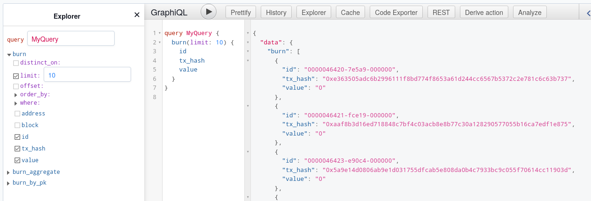

# Hasura add-on

## Running Hasura

To provision a [Hasura](https://hasura.io) instance, add an empty `deploy.addons.hasura` section to the [deployment manifest](/cloud/reference/manifest). Provide some basic configuration via the environment variables:
```yaml
deploy:
  env: 
    HASURA_GRAPHQL_ADMIN_SECRET: "${{ secrets.HASURA_SECRET }}"
    HASURA_GRAPHQL_UNAUTHORIZED_ROLE: user
    HASURA_GRAPHQL_STRINGIFY_NUMERIC_TYPES: "true"
  addons:
    postgres:
    hasura:
```
Note the use of a [Cloud secret](/cloud/resources/env-variables/#secrets) for storing the admin password.

## Configuring a Hasura API

### Using with a squid

If you're using Hasura with a [squid](/sdk/overview) that [writes its data to PostgreSQL](/sdk/resources/persisting-data/typeorm), you will need to configure the API manually. For basic table queries:

1. Visit the Hasura console using the API link from your squid's page in the [Cloud app](https://app.subsquid.io/squids).

2. Navigate to `Data > Data Manager > Databases > default > public` and click `Track` for all tables you would like to expose over your API.

   

3. Observe the schema change at `API > GraphiQL`.

   

### Using with a DipDup indexer

[DipDup](https://dipdup.io) configures Hasura automatically. See the [DipDup section](/external-tools/#dipdup) for details.
