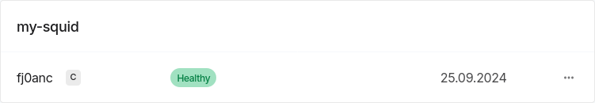
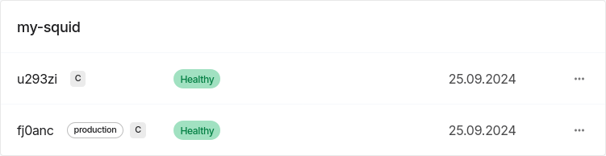
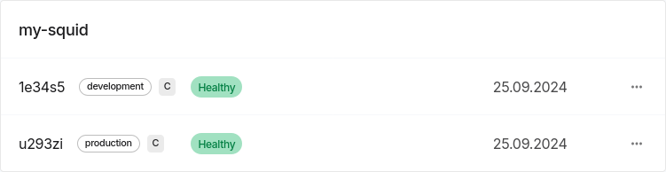

# Guide to Deployments 2.0

## Concepts

The new deployments system is built on two new concepts:

* **Slot:** Given a squid name and an [organization](/cloud/resources/organizations), slot name uniquely identifies a squid deployment.
  - If you don't provide a slot name on deployment, Cloud will generate one for you.
  - Deploying to the same slot twice results in an error.
* **Tags:** A way to mark deployments.
  Tags rules:
  - Each tag can be assigned to only one deployment among those that have the same name + organization. Assigning an existing tag _moves_ it.
  - Multiple tags can be assigned to any one deployment.
  Tags uses:
  - You can access APIs of deployments by tags.
  - You can address deployments by their tags to perform various operations, including redeployment.

Both tags and slots can be specified in squid manifest as well as via command line, giving rise to a variety of possible workflows.

## Examples

### Zero-downtime updates

:::info
Functionality described in this section is identical to that of the deprecated [production aliases](/cloud/resources/production-alias).
:::

As you develop your squid you will sometimes need to re-sync it from scratch. With tags you can do this without a maintenance downtime. Here's how to prepare:

1. Pick any squid (e.g. [the EVM template](https://github.com/subsquid-labs/squid-evm-template/)) and open its manifest (`squid.yaml` by default). Remove any of the following sections:

   * `version:`
   * `slot:`
   * `tag:`

   Top sections of the manifest should look roughly like this:
   ```yaml
   manifestVersion: subsquid.io/v0.1
   name: my-squid
   description: 'The very first...
   ```

2. Deploy the squid with `sqd deploy .` while in the project folder. Once the deployment is complete, `sqd` will display a message like this one:
   ```
   =================================================
   A new squid my-org/my-squid@fj0anc has been successfully created
   =================================================
   ```
   `fj0anc` is the slot name that Cloud automatically assigned to your squid deployment. Here's how this deployment looks like in [the app](https://app.subsquid.io/squids):

   

   At this stage you can already access your deployment's API via a slot-based URL. However, that API will go down if we reset the deployment's database. We'll use a tag-based URL instead to prevent the downtime.

3. Assign any tag to your deployment:
   ```bash
   sqd tags add production -n my-squid -s fj0anc
   ```
   This adds the tag `production` to the deployment and makes its API accessible via a tag-based URL:
   ```
   https://my-org.squids.live/my-squid:production/api/graphql
   ```
   Use this URL to access the API in your frontend app.

**Now, suppose you've made some changes to your codebase and need to re-sync your squid from scratch.** Here are the steps:

1. Make one more deployment of your squid. For that you can just re-run `sqd deploy .`: since no slot, version or tag is supplied in the manifest, the Cloud will automatically create a new slot for you. The final state of the Cloud may look like this:

   

2. Wait for your new deployment to sync, then test its API using its slot-based (_canonical_) URL:
   ```
   https://my-org.squids.live/my-squid@u293zi/api/graphql
   ```

3. When you're ready to switch, simply reassign the `production` tag to the new deployment:
   ```bash
   sqd tags add production -n my-squid -s u293zi
   ```
   Now the tag-based API URL points to the API of the new deployment, `u293zi`. Switching typically takes just a few seconds.

4. If you no longer need your old deployment, remove it by slot:
   ```bash
   sqd rm -n my-squid -s fj0anc
   ```

### Multiple major versions

With tags, you can maintain multiple major versions of your API under the same squid name. Once you make the API-breaking changes to your codebase, make another deployment and add a new tag to it:
```bash
sqd deploy .
# then, assuming that the new deployment got slot f69x40
sqd tags add production-v1 -n my-squid -s f69x40
```
Alternatively, you can use the `--add-tag` option of `sqd deploy` to do the same thing without having to handle the autogenerated slot name:
```bash
sqd deploy . --add-tag production-v1
```
This will produce exactly the same result. Here's how it may look like in the Cloud app:


Now you have two independent APIs accessible by tag-based URLs and you can perform [zero-downtime updates](#zero-downtime-updates) on each.

### Development patterns

In the [previous section](#multiple-major-versions) we considered the situation when multiple tags are used to denote major versions of the API. However, the exact same mechanics can be used to separate, for example, development from production:



In this case your `development` deployment likely won't need zero-downtime updates. Instead, you'll want to perform various operations on it frequently and with ease. For that, Squid CLI commands allow addressing deployments by tag. For example, you can read logs of your `development` deployment with
```bash
sqd logs -n my-squid -t development
```
Moreover, you can update your `development`-tagged deployment without having to know its slot name:
```bash
sqd deploy . -t development
```
It's even possible to ensure that whenever you deploy from the current directory, the deployment goes to the slot tagged `development`. Simply add the following line to `squid.yaml`:
```yaml
tag: development
```
This may serve as a protective mechanism against accidentally overwriting the production deployment or making a new deployment.
