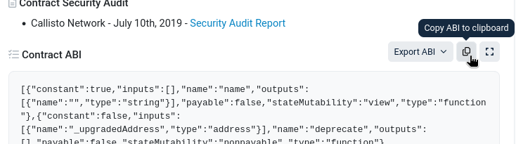

import Tabs from '@theme/Tabs';
import TabItem from '@theme/TabItem';

Here's an example of how SDK packages can be combined into a working indexer (called *squid*).

This page goes through all the technical details to make the squid architecture easier to understand. If you would like to get to a working indexer ASAP, [bootstrap from a template](/sdk/how-to-start/squid-development/#templates).

## USDT transfers API

**Pre-requisites**: NodeJS 20.x or newer, Docker.

Suppose the task is to track transfers of USDT on Ethereum, then save the resulting data to PostgreSQL and serve it as a GraphQL API. From this description we can immediately put together a list of [packages](/sdk/overview):

* `@subsquid/evm-processor` - for retrieving Ethereum data
* the triad of `@subsquid/typeorm-store`, `@subsquid/typeorm-codegen` and `@subsquid/typeorm-migration` - for saving data to PostgreSQL

We also assume the following choice of _optional_ packages:

* `@subsquid/evm-typegen` - for decoding Ethereum data and useful constants such as event topic0 values
* `@subsquid/evm-abi` - as a peer dependency for the code generated by `@subsquid/evm-typegen`
* `@subsquid/graphql-server` / [OpenReader](/sdk/reference/openreader-server)

To make the indexer, follow these steps:

1. Create a new folder and initialise a new project
   * create `package.json`
     ```bash
     npm init
     ```
   * add `.gitignore`
     ```bash title=".gitignore"
     node_modules
     lib
     ```

2. Install the packages:
   ```bash
   npm i dotenv typeorm @subsquid/evm-processor @subsquid/typeorm-store @subsquid/typeorm-migration @subsquid/graphql-server @subsquid/evm-abi
   ```
   ```bash
   npm i typescript @subsquid/typeorm-codegen @subsquid/evm-typegen --save-dev
   ```

3. Add a minimal `tsconfig.json`:
   ```json title="tsconfig.json"
   {
     "compilerOptions": {
       "rootDir": "src",
       "outDir": "lib",
       "module": "commonjs",
       "target": "es2020",
       "esModuleInterop": true,
       "skipLibCheck": true,
       "experimentalDecorators": true,
       "emitDecoratorMetadata": true
     }
   }
   ```

4. Define the schema for both the database and the core GraphQL API in [`schema.graphql`](/sdk/reference/schema-file):
   ```graphql title="schema.graphql"
   type Transfer @entity {
     id: ID!
     from: String! @index
     to: String! @index
     value: BigInt!
   }
   ```

5. Generate TypeORM classes based on the schema:
   ```bash
   npx squid-typeorm-codegen
   ```
   The TypeORM classes are now available at `src/model/index.ts`.

6. Prepare the database:
   * create `.env` and `docker-compose.yaml` files
     ```bash title=".env"
     DB_NAME=squid
     DB_PORT=23798
     RPC_ETH_HTTP=https://rpc.ankr.com/eth
     ```
     ```yaml title="docker-compose.yaml"
     services:
       db:
         image: postgres:15
         environment:
           POSTGRES_DB: "${DB_NAME}"
           POSTGRES_PASSWORD: postgres
         ports:
           - "${DB_PORT}:5432"
     ```
   * start the database container
     ```bash
     docker compose up -d
     ```
   * compile the TypeORM classes
     ```bash
     npx tsc
     ```
   * generate the migration file
     ```bash
     npx squid-typeorm-migration generate
     ```
   * apply the migration with
     ```bash
     npx squid-typeorm-migration apply
     ```

7. [Generate utility classes](/sdk/resources/tools/typegen/generation) for decoding [USDT contract](https://etherscan.io/address/0xdac17f958d2ee523a2206206994597c13d831ec7) data based on its ABI.

   - Create an `./abi` folder:
     ```bash
     mkdir abi
     ```

   - Find the ABI at the ["Contract" tab of the contract page on Etherscan](https://etherscan.io/address/0xdAC17F958D2ee523a2206206994597C13D831ec7#code). Scroll down a bit:
     

   - Copy the ABI, then paste to a new file at `./abi/usdt.json`.

   - Run the utility classes generator:
     ```bash
     npx squid-evm-typegen src/abi ./abi/*
     ```

   The utility classes are now available at `src/abi/usdt.ts`

8. Tie all the generated code together with a `src/main.ts` executable with the following code blocks:
   * Imports
     ```ts
     import { EvmBatchProcessor } from '@subsquid/evm-processor'
     import { TypeormDatabase } from '@subsquid/typeorm-store'
     import * as usdtAbi from './abi/usdt'
     import { Transfer } from './model'
     ```
   * [`EvmBatchProcessor`](/sdk/reference/processors/evm-batch) object definition
     ```ts
     const processor = new EvmBatchProcessor()
       .setGateway('https://v2.archive.subsquid.io/network/ethereum-mainnet')
       .setRpcEndpoint({
         url: process.env.RPC_ETH_HTTP,
         rateLimit: 10
       })
       .setFinalityConfirmation(75) // 15 mins to finality
       .addLog({
         address: [ '0xdAC17F958D2ee523a2206206994597C13D831ec7' ],
         topic0: [ usdtAbi.events.Transfer.topic ]
       })
     ```
   * [`TypeormDatabase`](/sdk/reference/store/typeorm) object definition
     ```ts
     const db = new TypeormDatabase()
     ```
   * A call to [`processor.run()`](/sdk/reference/processors/architecture/#processorrun) with an inline definition of the [batch handler](/sdk/reference/processors/architecture/#batch-context)
     ```ts
     processor.run(db, async ctx => {
       const transfers: Transfer[] = []
       for (let block of ctx.blocks) {
         for (let log of block.logs) {
           let {from, to, value} = usdtAbi.events.Transfer.decode(log)
           transfers.push(new Transfer({
             id: log.id,
             from, to, value
           }))
         }
       }
       await ctx.store.insert(transfers)
     })
     ```
     Note how supplying a `TypeormDatabase` to the function caused `ctx.store` to be a [PostgreSQL-compatible `Store` object](/sdk/reference/store/typeorm/#store-interface).

9. Compile the project and start the [processor process](/sdk/overview/#processor)
   ```bash
   npx tsc
   ```
   ```bash
   node -r dotenv/config lib/main.js
   ```

10. In a separate terminal, configure the GraphQL port and start the GraphQL server:
    ```diff title=".env"
     DB_NAME=squid
     DB_PORT=23798
     RPC_ETH_HTTP=https://rpc.ankr.com/eth
    +GRAPHQL_SERVER_PORT=4350
    ```
    ```bash
    npx squid-graphql-server
    ```

The finished GraphQL API with GraphiQL is available at [localhost:4350/graphql](http://localhost:4350/graphql).

Final code for this mini-tutorial is available in [this repo](https://github.com/subsquid-labs/squid-from-scratch).

:::tip
The commands listed here are often abbreviated as [custom `sqd` commands](/squid-cli/commands-json) in squids. If you'd like to do that too you can use the [`commands.json` file of the EVM template](https://github.com/subsquid-labs/squid-evm-template/blob/main/commands.json) as a starter.
:::
