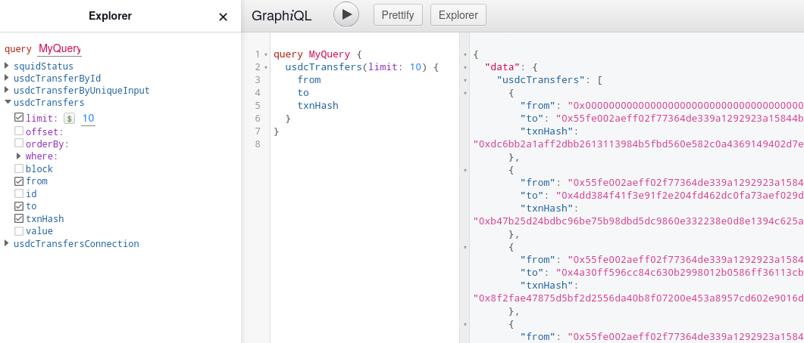

# Quickstart

This is a 5 min quickstart on how to build an indexer using Squid SDK.

[//]: # (It is based on a EVM-template. For other chains, inspect the Solana Quickstart, the Fuel Quickstart...)

The indexer (squid) will:
- Fetch all historical USDC transfers on Ethereum from the SQD Network
- Decode it
- Save it to a local Postgres database
- Start a GraphQL server with a rich API to query the historical USDC transfers.

## Prerequisites

- (On Windows) [WSL](https://learn.microsoft.com/en-us/windows/wsl/install)
- Node.js v18+
- Git
- Docker (for running Postgres)

## Step 1

Install Squid CLI: 

```bash
npm i -g @subsquid/cli
```

Squid CLI is a multi-purpose utility tool for scaffolding and managing the indexers, both locally and in SQD Cloud. 

## Step 2

Scaffold the indexer project (squid) from an example repo using Squid CLI:

```bash
sqd init hello-squid -t https://github.com/subsquid-labs/showcase01-all-usdc-transfers
cd hello-squid
```

The example is just a public GitHub repo with a squid project pre-configured to index USDC.

## Step 3

Inspect the `./src` folder:

```bash
src/
├── abi
│   └── usdc.ts
├── main.ts
└── model
    ├── generated
    │   ├── index.ts
    │   ├── marshal.ts
    │   └── usdcTransfer.model.ts
    └── index.ts
```
Here,
 * `src/abi/usdc` is a utility module generated from the JSON ABI of the USDC contract. It contains methods for event decoding, direct RPC queries and some useful constants.
 * `src/model` contains TypeORM model classes autogenerated from `schema.graphql`. Squids use them to populate Postgres.

`main.ts` is the main executable. In this example, it also contains all the data retrieval configuration:

```ts
const processor = new EvmBatchProcessor()
  // SQD Network gateways are the primary source of blockchain data in
  // squids, providing pre-filtered data in chunks of roughly 1-10k blocks.
  // Set this for a fast sync.
  .setGateway('https://v2.archive.subsquid.io/network/ethereum-mainnet')
  // Another data source squid processors can use is chain RPC.
  // In this particular squid it is used to retrieve the very latest chain data
  // (including unfinalized blocks) in real time. It can also be used to
  //   - make direct RPC queries to get extra data during indexing
  //   - sync a squid without a gateway (slow)
  .setRpcEndpoint('https://rpc.ankr.com/eth')
  // The processor needs to know how many newest blocks it should mark as "hot".
  // If it detects a blockchain fork, it will roll back any changes to the
  // database made due to orphaned blocks, then re-run the processing for the
  // main chain blocks.
  .setFinalityConfirmation(75)
  // .addXXX() methods request data items. In this case we're asking for
  // Transfer(address,address,uint256) event logs emitted by the USDC contract.
  //
  // We could have omitted the "address" filter to get Transfer events from
  // all contracts, or the "topic0" filter to get all events from the USDC
  // contract, or both to get all event logs chainwide. We also could have
  // requested some related data, such as the parent transaction or its traces.
  //
  // Other .addXXX() methods (.addTransaction(), .addTrace(), .addStateDiff()
  // on EVM) are similarly feature-rich.
  .addLog({
    range: { from: 6_082_465 },
    address: [USDC_CONTRACT_ADDRESS],
    topic0: [usdcAbi.events.Transfer.topic],
  })
  // .setFields() is for choosing data fields for the selected data items.
  // Here we're requesting hashes of parent transaction for all event logs.
  .setFields({
    log: {
      transactionHash: true,
    },
  })
```

The rest of the file is about data processing and storage:

```ts
// TypeormDatabase objects store the data to Postgres. They are capable of
// handling the rollbacks that occur due to blockchain forks.
//
// There are also Database classes for storing data to files and BigQuery
// datasets.
const db = new TypeormDatabase({supportHotBlocks: true})

// The processor.run() call executes the data processing. Its second argument is
// the handler function that is executed once on each batch of data. Processor
// object provides the data via "ctx.blocks". However, the handler can contain
// arbitrary TypeScript code, so it's OK to bring in extra data from IPFS,
// direct RPC calls, external APIs etc.
processor.run(db, async (ctx) => {
  // Making the container to hold that which will become the rows of the
  // usdc_transfer database table while processing the batch. We'll insert them
  // all at once at the end, massively saving IO bandwidth.
  const transfers: UsdcTransfer[] = []

  // The data retrieved from the SQD Network gatewat and/or the RPC endpoint
  // is supplied via ctx.blocks
  for (let block of ctx.blocks) {
    // On EVM, each block has four iterables - logs, transactions, traces,
    // stateDiffs
    for (let log of block.logs) {
      if (log.address === USDC_CONTRACT_ADDRESS &&
          log.topics[0] === usdcAbi.events.Transfer.topic) {
        // SQD's very own EVM codec at work - about 20 times faster than ethers
        let {from, to, value} = usdcAbi.events.Transfer.decode(log)
        transfers.push(new UsdcTransfer({
          id: log.id,
          block: block.header.height,
          from,
          to,
          value,
          txnHash: log.transactionHash
        }))
      }
    }
  }

  // Just one insert per batch!
  await ctx.store.insert(transfers)
})
```

## Step 4 
  
Install the dependencies and build

```bash
npm i
npm run build
```

## Step 5

The processor is a background process that continously fetches the data, decodes it and stores it in a local Postgres. All the logic is defined in `main.ts` and is fully customizable.

To run the processor, we first start a local Postgres where the decoded data is persisted (the template comes with a Docker compose file):
```bash
docker compose up -d
```
Processor will connect to Postgres using the connection parameters from `.env`.

Apply database migrations with
```bash
npx squid-typeorm-migration apply
```
then start the processor with
```bash
node -r dotenv/config lib/main.js
```
The indexer is now running.

## Step 6

Start the GraphQL API serving the transfers data from Postgres:
```bash
npx squid-graphql-server
```
The server comes with a GraphQL playground available at [`localhost:4350/graphql`](http://localhost:4350/graphql).



## Step 7

Query the data!
