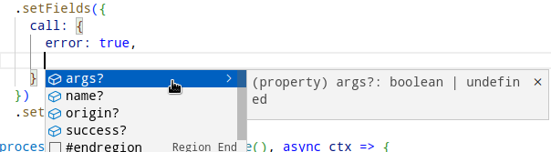

# Fields selection

#### `setFields(options)` {#set-fields}

Set the fields to be retrieved for data items of each supported type. The `options` object has the following structure:
```ts
{
  event?:     // field selector for logs
  call?:      // field selector for transactions
  extrinsic?: // field selector for state diffs
  block?:     // field selector for block headers
}
```

Every field selector is a collection of boolean fields mapping one-to-one to the fields of data items within the batch context [iterables](../context-interfaces). Setting a field of a field selector of a given type to true, like this
```ts
let processor = new SubstrateBatchProcessor()
  .setFields({
    call: {
      origin: true
    }
  })
```
will cause the processor to populate the corresponding field (in this case `origin`) of all data items of that type (in this case `Call`). The field will be available in all data items of the type, including nested items. Suppose we used the processor defined above to subscribe to some calls as well as some events, and for each event we requested a parent call:
```ts
processor
  .addEvent({
    // some event data requests
    call: true
  })
  .addCall({
    // some call data requests
  })
```
As a result, the `origin` field would be available both within the call items retrieved due to `.addCall()` and within the call items that provide parent call information for the events:
```ts
processor.run(db, async ctx => {
  for (let block of ctx.blocks) {
    for (let call of block.calls) {
      let callOrigin = call.origin // OK
    }
    for (let event of block.events) {
      let parentCallOrigin = event.call?.origin // also OK!
    }
  }
})
```

Some data fields are enabled by default but can be disabled by setting a field of a field selector to `false`. For example, this code will not compile:
```ts
let processor = new SubstrateBatchProcessor()
  .setFields({
    call: {
      name: false
    }
  })
  .addCall({
    // some call data requests
  })

processor.run(db, async ctx => {
  for (let block of ctx.blocks) {
    for (let call of block.calls) {
      let callName = call.name // ERROR: no such field
    }
  }
})
```
Disabling unused fields will improve sync performance, as the disabled fields will not be fetched from SQD Network.

## Data item types and field selectors

:::tip
Most IDEs support smart suggestions to show the possible field selectors. For VS Code, press `Ctrl+Space`:

:::

Here we describe the data item types as functions of the field selectors. In `SubstrateBatchProcessor` each field of a field selector maps to the eponymous field of its corresponding data item type. Item data fields are divided into three categories:
* Fields that are added independently of the `setFields()` call. These are either fixed or depend on the related data retrieval flags (e.g. `call` for events).
* Fields that can be disabled by `setFields()`. E.g. the `args` field will be fetched for calls by default, but can be disabled by setting `args: false` within the `call` field selector.
* Fields that can be requested by `setFields()`. E.g. the `tip` field will only be available in extrinsics if the `extrinsic` field selector sets `tip: true`.

In addition to data fields, data items have methods that simplify access to related data, e.g. `Call.getExtrinsic()`.

### Events

`Event` data items may have the following fields:
```ts
Event {
  // can be requested with field selectors
  phase: 'ApplyExtrinsic' | 'Initialization' | 'Finalization'

  // can be disabled with field selectors
  name: string
  args: any

  // independent of field selectors
  id: string
  index: number
  block: BlockHeader
  callAddress?: number[]
  call?: Call
  extrinsicIndex?: number
  extrinsic?: Extrinsic

  // methods
  getCall(): Call
  getExtrinsic(): Extrinsic
}
```
Definition of the types mentioned are available in their respective sections:
- [`BlockHeader`](#block-headers),
- [`Call`](#calls),
- [`Extrinsic`](#extrinsics).

### Calls

`Call` data items may have the following fields:
```ts
Call {
  // can be requested with field selectors
  error?: any
  origin?: any
  success: boolean
  
  // can be disabled with field selectors
  name: string
  args: any

  // independent of field selectors
  id: string
  address: number[]
  block: BlockHeader
  events: Event[]
  parentCall?: Call
  subcalls: Call[]
  extrinsicIndex: number
  extrinsic?: Extrinsic

  // methods
  getParentCall(): Call
  getExtrinsic(): Extrinsic
}
```
Definition of the types mentioned are available in their respective sections:
- [`BlockHeader`](#block-headers),
- [`Event`](#events),
- [`Extrinsic`](#extrinsics).

### Extrinsics

`Extrinsic` data items may have the following fields:
```ts
Extrinsic {
  // can be requested with field selectors
  success: boolean
  error?: unknown
  fee?: bigint
  hash: string
  signature?: {
    // no per-field selection here:
    // "signature: true" gets all fields
    address: unknown
    signature: unknown
    signedExtensions: unknown
  }
  tip?: bigint
  version: number
  
  // independent of field selectors
  id: string
  index: number
  block: BlockHeader
  events: Event[]
  call?: Call
  subcalls: Call[]

  // methods
  getCall(): Call
}
```
Definition of mentioned types are available in their respective sections:
- [`BlockHeader`](#block-headers),
- [`Event`](#events),
- [`Call`](#calls),

### Block headers

`BlockHeader` data items may have the following fields:
```ts
BlockHeader{
  // can be requested with field selectors
  digest: { // request with "digest: true"
    logs: string[]
  }
  extrinsicsRoot: string
  stateRoot: string
  timestamp?: number
  validator?: string

  // independent of field selectors
  id: string
  hash: string
  height: number
  implName: string
  implVersion: number
  parentHash: string
  specName: string
  specVersion: number
  _runtime: Runtime
  _runtimeOfPrevBlock: Runtime
  
  // methods
  getParent(): {
    _runtime: Runtime
    hash: string
    height: number
  }
}
```
`Runtime` is an internal type that tools like [squid-substrate-typegen](/sdk/resources/tools/typegen) use for dealing with Substrate runtime versions. The curious may take a look at the definition [here](https://github.com/subsquid/squid-sdk/blob/master/substrate/substrate-runtime/src/runtime/runtime.ts).

## A complete example

Fetch `Balances.Transfer` events and `Balances.transfer_keep_alive` calls along with their parent extrinsics. Enrich the extrinsics with hashes, fees and success flags:
```ts
const processor = new SubstrateBatchProcessor()
  .addEvent({
    name: ['Balances.Transfer'],
    extrinsic: true
  })
  .addCall({
    name: ['Balances.transfer_keep_alive'],
    extrinsic: true
  })
  .setFields({
    extrinsic: {
      hash: true,
      fee: true,
      success: true
    }
  })
```
