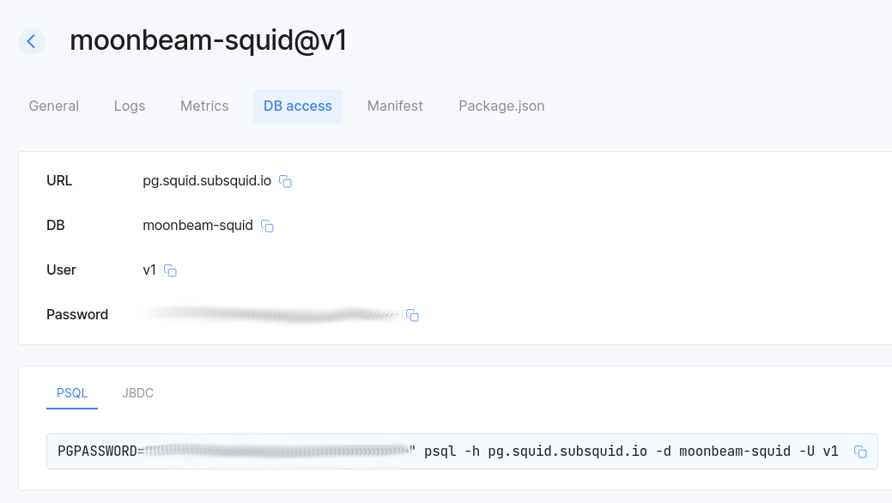

# Alternatives to the SDK GraphQL server

We encourage using squids with third-party GraphQL tools like [PostGraphile](https://www.graphile.org/postgraphile/) and [Hasura](https://hasura.io). No special configuration is required and there aren't any constraints on running them in [Subsquid Cloud](/cloud).

## PostGraphile

Here we cover one possible way of integrating PostGraphile into a squid project ([full example](https://github.com/subsquid-labs/squid-postgraphile-example/)). Note the following:

* There is a dedicated entry point for PostGraphile (`src/api.ts`). It is complemented by an [`sqd` command](https://github.com/subsquid-labs/squid-postgraphile-example/blob/f1fd1691eb59da2c9d57c475a71d0ed44cfed891/commands.json#L58) and a [manifest entry](https://github.com/subsquid-labs/squid-postgraphile-example/blob/f1fd1691eb59da2c9d57c475a71d0ed44cfed891/squid.yaml#L15). This makes it easier to run the squid both locally (with [`sqd run`](/squid-cli/run)) and in [Cloud](/cloud).

* As per usual with PostGraphile installations, you can freely extend it with plugins, including your own. Here is an [example plugin for serving the `_squidStatus` queries](https://github.com/subsquid-labs/squid-postgraphile-example/blob/f1fd1691eb59da2c9d57c475a71d0ed44cfed891/src/api.ts#L11) from the standard Squid SDK GraphQL server schema.

## Hasura

Although it is possible to run Hasura in Subsquid Cloud, we expect most Hasura setups to host their GraphQL servers elsewhere to avoid unnecessary credentials sharing. If you want to run it in Subsquid Cloud, let us know in [SquidDevs Telegram chat](https://t.me/HydraDevs).

Otherwise, simply supply the database credentials from the [Subsquid Cloud console](https://app.subsquid.io/squids/) in your Hasura configuration.

