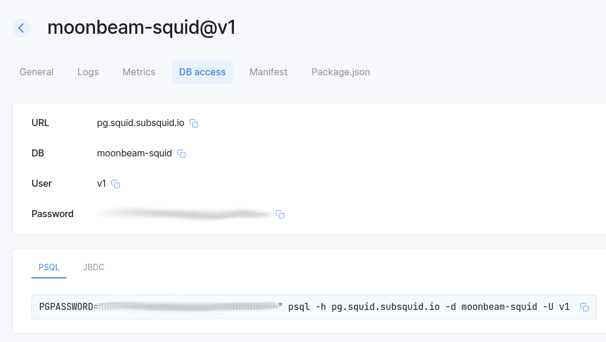

# Serving GraphQL

It is common (although not required) for squids to serve GraphQL APIs. Historically, the most common way to do that was to [persist the squid data to PostgreSQL](/sdk/resources/persisting-data/typeorm), then attach [OpenReader](#openreader) to it. Although this is still supported, we encourage using [PostGraphile](#postgraphile) or [Hasura](#hasura) in new PostgreSQD-based projects. See [OpenReader's limitations](/sdk/reference/openreader-server/overview/#limitations) if you're curious about our motivation.

## PostGraphile

[PostGraphile](https://www.graphile.org/postgraphile/) is an open-source tool that builds powerful, extensible and performant GraphQL APIs from PostgreSQL schemas. Its pros include:

- aggregations;
- reliable support for subscriptions;
- capability for deep API customization;
- organization of API customization code into plugins.

The recommended way of integrating PostGraphile into squid projects is by making a dedicated entry point at `src/api.ts`. A complete example squid implementing this approach is available in [this repository](https://github.com/subsquid-labs/squid-postgraphile-example/).

With this entry point in place, we [create a `sqd` command](https://github.com/subsquid-labs/squid-postgraphile-example/blob/f1fd1691eb59da2c9d57c475a71d0ed44cfed891/commands.json#L58) for running PostGraphile with [`commands.json`](/squid-cli/commands-json), then use it in the [`deploy.api` entry](https://github.com/subsquid-labs/squid-postgraphile-example/blob/f1fd1691eb59da2c9d57c475a71d0ed44cfed891/squid.yaml#L15) of [Squid manifest](/cloud/reference/manifest). Although none of this is required, this makes it easier to run the squid both locally (with [`sqd run`](/squid-cli/run)) and in the [Cloud](/cloud).

As per usual with PostGraphile installations, you can freely extend it with plugins, including your own. Here is an [example plugin for serving the `_squidStatus` queries](https://github.com/subsquid-labs/squid-postgraphile-example/blob/f1fd1691eb59da2c9d57c475a71d0ed44cfed891/src/api.ts#L11) from the standard Squid SDK GraphQL server schema. A plugin for making PostGraphile API fully compatible with [old APIs](/sdk/reference/openreader-server/api) served by OpenReader will be made available soon.

## Hasura

[Hasura](https://hasura.io) is a powerful open-source GraphQL engine. You can use it to:

- expose multiple data sources of different kinds (various databases, APIs etc) via a single API;
- reliably serve subscriptions;
- perform aggregations;
- deeply customize your CRUD API.

You can integrate Hasura with your squid in two ways:

1. **Use Hasura to gather data from multiple sources, including your squid.**

   For this scenario we recommend separating your Hasura instance from your squid, which should consist of just one service, [the processor](/sdk/reference/processors/architecture), plus the database. Supply your database credentials to Hasura, then configure it to produce the desired API.

   If you run your squid in our [Cloud](/cloud) you can find database credentials in [the app](https://app.subsquid.io/squids):

   

2. **Run a dedicated Hasura instance for serving the data just from your squid.**

   A complete example implementing this approach is available in [this repository](https://github.com/subsquid-labs/squid-hasura-example). Here's how it works:

    * Locally, Hasura runs in a [Docker container](https://github.com/subsquid-labs/squid-hasura-example/blob/70bb6d703dc90c1bb00b47f3fef7f388ab54e565/docker-compose.yml#L14C1-L28C20). In the Cloud it is managed via the [Hasura addon](/cloud/reference/hasura).
    * Hasura metadata is shared among all squid instances by means of the [Hasura configuration tool](/sdk/resources/tools/hasura-configuration). The tool can automatically create an initial configuration based on your [TypeORM models](/sdk/reference/schema-file/intro/#typeorm-codegen), then persist any changes you might make with the web GUI and metadata exports.
    * Admin authentication secret is set via the `HASURA_GRAPHQL_ADMIN_SECRET`. The variable is set in `.env` locally and from a [secret](/cloud/resources/env-variables/#secrets) in Cloud deployments.

   See the [configuration tool page](/sdk/resources/tools/hasura-configuration) and the [repo readme](https://github.com/subsquid-labs/squid-hasura-example#readme) for more details.

## OpenReader

[OpenReader](/sdk/reference/openreader-server) is a GraphQL server developed by the SQD team. Although still supported, it's not recommeded for new PostgreSQL-powered projects due to its [limitations](/sdk/reference/openreader-server/overview/#limitations), especially for APIs implementing GraphQL subscriptions.

The server uses the [schema file](/sdk/reference/schema-file) to produce its [core API](/sdk/reference/openreader-server/api) that can be extended with [custom resolvers](/sdk/reference/openreader-server/configuration/custom-resolvers). Extra features include [DoS protection](/sdk/reference/openreader-server/configuration/dos-protection) and [caching](/sdk/reference/openreader-server/configuration/caching).
