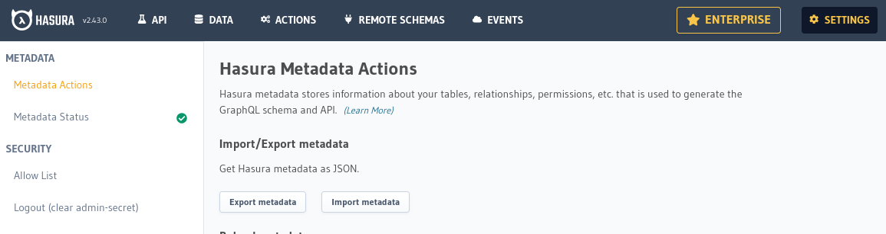

# Hasura configuration tool

:::info
For info on migrating to `@subsquid/hasura-configuration>=2.0.0` see [this page](/sdk/resources/migrate/migrate-to-hasura-configuration-tool-v2).
:::

[`@subsquid/hasura-configuration`](https://www.npmjs.com/package/@subsquid/hasura-configuration) is a tool for managing Hasura configuration in [PostgreSQL-powered squids](/sdk/resources/persisting-data/typeorm). Install it with
```bash
npm i @subsquid/hasura-configuration
```
Make sure that the following environment variables are set:

 * `HASURA_GRAPHQL_ENDPOINT` for Hasura URL (defaults to `http://localhost:8080`).
 * `HASURA_GRAPHQL_ADMIN_SECRET` for admin access (only required to use `squid-hasura-configuration apply`).
 * If your Hasura instance(s) use a role other than `public` to serve the anonymous part of your API, also set `HASURA_GRAPHQL_UNAUTHORIZED_ROLE`.

## Generating the initial configuration

The tool uses your squid's [TypeORM models](/sdk/reference/schema-file/intro/#typeorm-codegen) as input when generating the initial configuration. Make sure they are up to date.

<details>
<summary>Here's how</summary>

1. Finalize any edits to [`schema.graphql`](/sdk/reference/schema-file)

2. Update the TypeScript code of your models with
   ```bash
   npx squid-typeorm-codegen
   ```

3. Compile your models with
   ```bash
   npm run build
   ```

4. Regenerate your [DB migrations](/sdk/resources/persisting-data/typeorm/#database-migrations) with a clean database to make sure they match your updated schema.
   ```bash
   docker compose down
   docker compose up -d
   rm -r db
   npx squid-typeorm-migration generate
   ```

You can turn off your database after doing that - Hasura configuration tool does not use it to make its initial configuration

</details>

When done, run
```bash
npx squid-hasura-configuration regenerate
```
The generated configuration will be available at `hasura_metadata.json`. It enables:
- tracking all tables that correspond to [schema entities](/sdk/reference/schema-file/entities);
- `SELECT` permissions for the `public` (or `$HASURA_GRAPHQL_UNAUTHORIZED_ROLE` if it is defined) role for all columns in these tables;
- tracking all [entity relationships](/sdk/reference/schema-file/entity-relations).

## Applying the configuration

Make sure your database is up, your Hasura instance is connected to it and the schema is up to date. If necessary, apply the migrations:
```bash
npx squid-typeorm-migration apply
```

When done, you can apply the generated config with
```bash
npx squid-hasura-configuration apply
```
or import it using the _Settings > Metadata Actions > Import metadata_ function of the web GUI.

## Persisting configuration changes

:::warning
Regenerating `hasura_metadata.json` removes any modifications you might have made via metadata exporting. So, it is advisable that you finalize your schema before you begin any manual API fine-tuning.
:::

When running a squid with a dedicated Hasura instance you will notice that squid resetting operations (`docker compose down; docker compose up -d` and `sqd deploy -r`) restore your Hasura API to its non-configured state. As you develop your API further you may want to persist your changes. `squid-hasura-configuration` helps with that by being compatible with the _Settings > Metadata Actions > Import/Export metadata_ functions of the web GUI.



Any extra configuration you may make via the web GUI or [Hasura metadata API](https://hasura.io/docs/2.0/api-reference/metadata-api/index) can be persisted by exporting the metadata to `hasura_metadata.json` via the _Export metadata_ function, then applying it to blank Hasura instances with
```bash
npx squid-hasura-configuration apply
```

## Example

See [this repo](https://github.com/subsquid-labs/squid-hasura-example).
