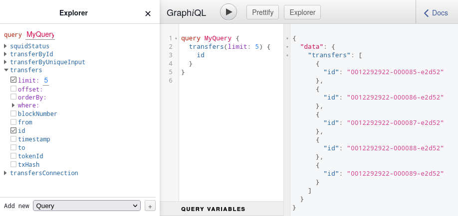

# Step 1: Indexing Transfer events

In this step-by-step tutorial we will build a squid that gets data about [Bored Ape Yacht Club](https://boredapeyachtclub.com) NFTs, their transfers and owners from the [Ethereum blockchain](https://ethereum.org), indexes the NFT metadata from [IPFS](https://ipfs.tech/) and regular HTTP URLs, stores all the data in a database and serves it over a GraphQL API. Here we do the first step: build a squid that indexes only the `Transfer` events emitted by the [BAYC token contract](https://etherscan.io/address/0xbc4ca0eda7647a8ab7c2061c2e118a18a936f13d).

Pre-requisites: Node.js, [Squid CLI](/squid-cli/installation), Docker.

## Starting with a template

Begin by retrieving the `evm` template and installing the dependencies:
```bash
sqd init my-bayc-squid -t evm
cd my-bayc-squid
npm i
```
The resulting code can be found at [this commit](https://github.com/subsquid-labs/bayc-squid-1/tree/4ad7bdfed0771aa6b6e9cf0368ac7f15f09cd629).

## Interfacing with the contract ABI

First, we inspect which data is available for indexing. For EVM contracts, the metadata descrbing the shape of the smart contract logs, transactions and contract state methods is distributed as an [Application Binary Interface](https://docs.soliditylang.org/en/latest/abi-spec.html) (ABI) JSON file. For many popular contracts ABI files are published on Etherscan (as in the case of the BAYC NFT contract). SQD provides a [tool](/sdk/resources/tools/typegen/state-queries/?typegen=evm) for retrieving contract ABIs from Etherscan-like APIs and generating the boilerplate for retrieving and decoding the data. For the contract of interest, this can be done with
```bash
npx squid-evm-typegen src/abi 0xbc4ca0eda7647a8ab7c2061c2e118a18a936f13d#bayc
```
Here, `src/abi` is the destination folder and the `bayc` suffix sets the base name for the generated file.

Checking out the generated `src/abi/bayc.ts` file we see all events and contract functions listed in the ABI. Among them there is the `Transfer` event:
```typescript
export const events = {
    ...
    Transfer: new LogEvent<([from: string, to: string, tokenId: bigint] & {from: string, to: string, tokenId: bigint})>(
        abi, '0xddf252ad1be2c89b69c2b068fc378daa952ba7f163c4a11628f55a4df523b3ef'
    ),
}
```
Reading about [elsewhere](https://eips.ethereum.org/EIPS/eip-721) we learn that it is emitted every time an NFT changes hand and that its [logs](https://medium.com/mycrypto/understanding-event-logs-on-the-ethereum-blockchain-f4ae7ba50378) contain the addresses of both involved parties, as well the unique ID of the token. This is the data we need, so we proceed to configure our squid to retrieve it.

## Configuring the data filters

A "squid processor" is the Node.js process and the [object that powers it](/sdk/overview/). Together they are responsible for retrieving filtered blockchain data from a specialized data lake ([SQD Network](/subsquid-network/overview)), transforming it and saving the result to a destination of choice. To configure the processor (object) to retrieve the `Transfer` events of the BAYC token contract, we initialize it like this:
```typescript title="src/processor.ts"
// ...
import * as bayc from './abi/bayc'

export const CONTRACT_ADDRESS = '0xbc4ca0eda7647a8ab7c2061c2e118a18a936f13d'

export const processor = new EvmBatchProcessor()
    .setGateway('https://v2.archive.subsquid.io/network/ethereum-mainnet')
    .setRpcEndpoint({
        url: '<my_eth_rpc_url>',
        rateLimit: 10
    })
    .setFinalityConfirmation(75)
    .setBlockRange({
        from: 12_287_507,
    })
    .addLog({
        address: [CONTRACT_ADDRESS],
        topic0: [bayc.events.Transfer.topic]
    })
    .setFields({
        log: {
            transactionHash: true
        }
    })
// ...
```

Here,
* `'https://v2.archive.subsquid.io/network/ethereum-mainnet'` is the URL the public SQD Network gateway for Ethereum mainnet. Check out the exhaustive [SQD Network gateways list](/subsquid-network/reference/networks).
* `'<eth_rpc_endpoint_url>'` is a public RPC endpoint we chose to use in this example. When an endpoint is available, the processor will begin ingesting data from it once it reaches the highest block available within SQD Network. Please use a private endpoint or SQD Cloud's [RPC addon](/cloud/resources/rpc-proxy) in production.
* `setFinalityConfirmation(75)` call instructs the processor to consider blocks final after 75 confirmations when ingesting data from an RPC endpoint.
* `12_287_507` is the block at which the BAYC token contract was deployed. Can be found on the [contract's Etherscan page](https://etherscan.io/address/0xbc4ca0eda7647a8ab7c2061c2e118a18a936f13d).
* The argument of [`addLog()`](/sdk/reference/processors/evm-batch/logs) is a set of filters that tells the processor to retrieve all event logs emitted by the BAYC contract with topic0 matching the hash of the full signature of the `Transfer` event. The hash is taken from the previously generated Typescript ABI.
* The argument of [`setFields()`](/sdk/reference/processors/evm-batch/field-selection/) specifies the exact data we need on every event to be retrieved. In addition to the data that is [provided by default](/sdk/reference/processors/evm-batch/field-selection/#logs) we are requesting hashes of parent transactions for all event logs.

See [configuration](/sdk/reference/processors/evm-batch) for more options.

## Decoding the event data

The other part of processor configuration is the callback function used to process batches of the filtered data, the [batch handler](/sdk/reference/processors/architecture/#processorrun). It is typically defined at the `processor.run()` call at `src/main.ts`, like this:
```typescript
processor.run(db, async (ctx) => {
    // data transformation and persistence code here
})
```
Here,
* `db` is a [`Database` implementation](/sdk/resources/persisting-data/overview/) specific to the target data sink. We want to store the data in a PostgreSQL database and present with a GraphQL API, so we provide a [`TypeormDatabase`](/sdk/resources/persisting-data/typeorm/) object here.
* `ctx` is a [batch context](/sdk/reference/processors/architecture/#batch-context) object that exposes a batch of data retrieved from SQD Network or a RPC endpoint (at `ctx.blocks`) and any data persistence facilities derived from `db` (at `ctx.store`).

Batch handler is where the raw on-chain data is decoded, transformed and persisted. This is the part we'll be concerned with for the rest of the tutorial.

We begin by defining a batch handler decoding the `Transfer` event:
```typescript title="src/main.ts"
import {TypeormDatabase} from '@subsquid/typeorm-store'
import {processor, CONTRACT_ADDRESS} from './processor'
import * as bayc from './abi/bayc'

processor.run(new TypeormDatabase(), async (ctx) => {
    for (let block of ctx.blocks) {
        for (let log of block.logs) {
            if (log.address === CONTRACT_ADDRESS && log.topics[0] === bayc.events.Transfer.topic) {
                let {from, to, tokenId} = bayc.events.Transfer.decode(log)
                ctx.log.info(`Parsed a Transfer of token ${tokenId} from ${from} to ${to}`)
            }
        }
    }
})
```
This goes through all the log items in the batch, verifies that they indeed are `Transfer` events emitted by the BAYC contract and decodes the data of each log item, then logs the results to the terminal. The verification step is required because the processor does not guarantee that it won't supply any extra data, only that it *will* supply the data matching the filters. The decoding is done with the `bayc.events.Transfer.decode()` function from the Typescript ABI we previously generated.

At this point the squid is ready for its first test run. Execute
```bash
docker compose up -d
npm run build
npx squid-typeorm-migration apply
node -r dotenv/config lib/main.js
```
and you should see lots of lines like these in the output:
```
03:56:02 INFO  sqd:processor Parsed a Transfer of token 6325 from 0x0000000000000000000000000000000000000000 to 0xb136c6A1Eb83d0b4B8e4574F28e622A57F8EF01A
03:56:02 INFO  sqd:processor Parsed a Transfer of token 6326 from 0x0000000000000000000000000000000000000000 to 0xb136c6A1Eb83d0b4B8e4574F28e622A57F8EF01A
03:56:02 INFO  sqd:processor Parsed a Transfer of token 4407 from 0x082C99d47E020a00C95460D50a83338d509A0e3a to 0x5cf0E6da6Ec2bd7165edcD52D3d31f2528dCf007
```
The full code can be found at [this commit](https://github.com/subsquid-labs/bayc-squid-1/tree/b7ccfc06b283a885878cddcb18483c4bf571e97c).

## Extending and persisting the data

`TypeormDatabase` requires us to define a TypeORM data model to actually send the data to the database. In SQD, the same data model is also used by the GraphQL server to generate the API schema. To avoid any potential discrepancies, processor and GraphQL server rely on a shared data model description defined at `schema.graphql` in a GraphQL schema dialect fully documented [here](/sdk/reference/schema-file/).

TypeORM code is generated from `schema.graphql` with the [`squid-typeorm-codegen`](/sdk/resources/persisting-data/typeorm) tool and must be regenerated every time the schema is changed. This is usually accompanied by regenerating the [database migrations](/sdk/resources/persisting-data/typeorm/) and recreating the database itself. The migrations are applied before every run of the processor, ensuring that whenever any TypeORM code within the processor attempts to access the database, the database is in a state that allows it to succeed.

The main unit of data in `schema.graphql` is [entity](/sdk/reference/schema-file/entities/). These map onto [TypeORM entites](https://typeorm.io/entities) that in turn map onto database tables. We define one for `Transfer` events by replacing the file contents with
```graphql title="schema.graphql"
type Transfer @entity {
    id: ID!
    tokenId: BigInt! @index
    from: String! @index
    to: String! @index
    timestamp: DateTime!
    blockNumber: Int!
    txHash: String! @index
}
```
Here,
* The `id` is a required field and the `ID` type is an alias for `String`. Entity IDs must be unique.
* `@index` decorators tell the codegen tool that the corresponding database columns should be indexed.
* Extra fields `timestamp` and `blockNumber` are added to make the resulting GraphQL API more convenient. We will fill them using the block metadata available in `ctx`.

Once we're done editing the schema, we regenerate the TypeORM code, recreate the database and regenerate the migrations:
```bash
npx squid-typeorm-codegen
npm run build
docker compose down
docker compose up -d
rm -r db/migrations
npx squid-typeorm-migration generate
```
The generated code is in `src/model`. We can now import a `Transfer` entity class from there and use it to perform [various operations](/sdk/resources/persisting-data/typeorm/) on the corresponding database table. Let us rewrite our batch handler to save the parsed `Transfer` events data to the database:
```typescript title="src/main.ts"
import {TypeormDatabase} from '@subsquid/typeorm-store'
import {processor, CONTRACT_ADDRESS} from './processor'
import * as bayc from './abi/bayc'
import {Transfer} from './model'

processor.run(new TypeormDatabase(), async (ctx) => {
    let transfers: Transfer[] = []

    for (let block of ctx.blocks) {
        for (let log of block.logs) {
            if (log.address === CONTRACT_ADDRESS && log.topics[0] === bayc.events.Transfer.topic) {
                let {from, to, tokenId} = bayc.events.Transfer.decode(log)
                transfers.push(new Transfer({
                    id: log.id,
                    tokenId,
                    from,
                    to,
                    timestamp: new Date(block.header.timestamp),
                    blockNumber: block.header.height,
                    txHash: log.transactionHash,
                }))
            }
        }
    }

    await ctx.store.insert(transfers)
})
```
Note a few things here:
* A unique event log ID is available at `log.id` - no need to generate your own!
* `tokenId` returned from the decoder is an `ethers.BigNumber`, so it has to be explicitly converted to `number`. The conversion is valid only because we know that BAYC NFT IDs run from 0 to 9999; in most cases we would use `BigInt` for the entity field type and convert with `tokenId.toBigInt()`.
* `block.header` contains block metadata that we use to fill the extra fields.
* Accumulating the `Transfer` entity instances before using `ctx.store.insert()` on the whole array of them in the end allows us to get away with just one database transaction per batch. This is [crucial for achieving a good syncing performance](/sdk/resources/batch-processing/).

At this point we have a squid that indexes the data on BAYC token transfers and is capable of serving it over a GraphQL API. Full code is available at [this commit](https://github.com/subsquid-labs/bayc-squid-1/tree/aeb6268168385cc605ce04fe09d0159f708efe47). Test it by running
```bash
npm run build
npx squid-typeorm-migration apply
node -r dotenv/config lib/main.js
```
then
```bash
npx squid-graphql-server
```
in a separate terminal. If all is well, a GraphiQL playground should become available at [localhost:4350/graphql](http://localhost:4350/graphql):


