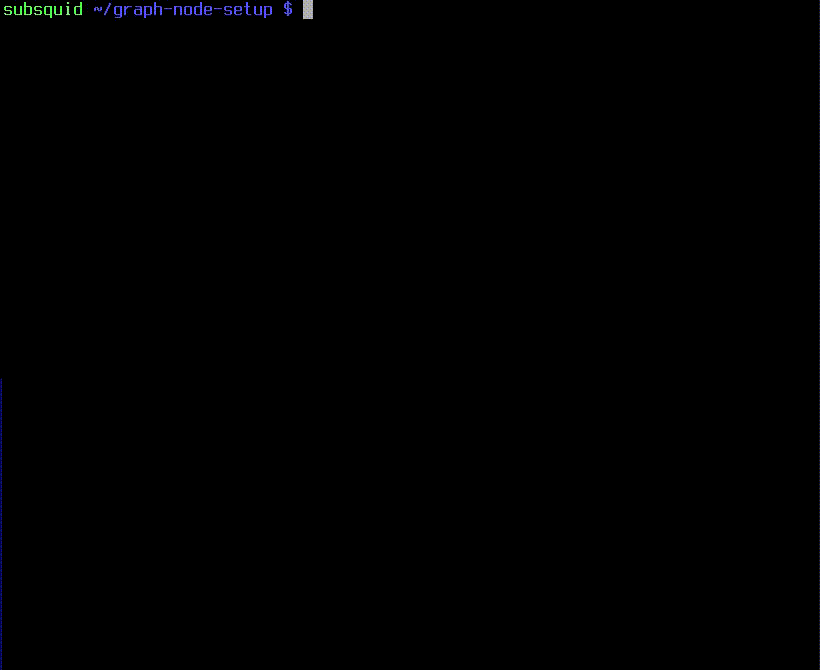

# Run subgraphs without full nodes

:::warning
This tutorial uses alpha-quality software. If you encouter any issues while using it please let us know at the [SquidDevs Telegram chat](https://t.me/HydraDevs).
:::

**Dependencies**: Docker, Git, NodeJS, Yarn.

Developing and running [subgraphs](https://thegraph.com/docs/en/glossary/) is hard, as one has to run a full archival node, and for many networks it is not feasible to run a full archival node to at all. 

**SQD Firehose** is an open-source lightweight adapter run as a side-car to a graph indexer node, ingesting and filtering the data directly from SQD Network instead of an RPC endpoint. However, since the network does not provide the real-time blocks, the most recent and unfinalized blocks are (optionally) ingested from a complementary RPC endpoint in a seamless way.

Currently it is only possible to run subgraphs against a production-ready [permissioned SQD Network instance](/subsquid-network/overview/#open-private-network) (formerly known as Subsquid Archives). Running against the decentralized SQD Network is scheduled to be supported in Q2 2024 (see [SQD Network Overview](/subsquid-network/overview) to learn more about the difference).

The easiest way to run a subgraph with SQD Firehose to use our [graph-node-setup](https://github.com/subsquid-labs/graph-node-setup) repo. Here's how:

1. Clone the repo and install the dependencies:
   ```bash
   git clone https://github.com/subsquid-labs/graph-node-setup
   cd graph-node-setup
   npm ci
   ```

2. Interactively configure the environment with
   ```bash
   npm run configure
   ```

   

   You will be asked to select a network. You can pick any network from our [supported EVM networks](/subsquid-network/reference/networks/#evm--ethereum-compatible); networks that are not currently [supported by TheGraph](https://thegraph.com/docs/en/developing/supported-networks/) will be available their under SQD names.

   Optionally you can also provide an RPC endpoint. If you do, it will be used to sync a few thousands of blocks at the chain end, so it does not have to be a paid one. However, `firehose-grpc` does not limit its request rate yet, so using a public RPC might result in a cooldown.

   If you do not provide an RPC endpoint, your subgraph deployments will be a few thousands of blocks behind the chain head.

   :::warning
   Running against the decentralized testnet is not currently supported. This feature will be re-enabled in Q2 2024.
   :::

3. Download and deploy your subgraph of choice! For example, if you configured the environment to use Ethereum mainnet (`eth-mainnet`), you can deploy the well known Gravatar subgraph:
   ```bash
   git clone https://github.com/graphprotocol/example-subgraph
   cd example-subgraph

   # the repo is a bit outdated, giving it a deps update
   rm yarn.lock
   npx --yes npm-check-updates --upgrade
   yarn install

   # generate classes for the smart contract
   # and events used in the subgraph
   npm run codegen

   # create and deploy the subgraph
   npm run create-local
   npm run deploy-local
   ```
   GraphiQL playground will be available at [http://127.0.0.1:8000/subgraphs/name/example/graphql](http://127.0.0.1:8000/subgraphs/name/example/graphql).

## Troubleshooting

Do not hesitate to let us know about any issues (whether listed here or not) at the [SquidDevs Telegram chat](https://t.me/HydraDevs).

* If your subgraph is not syncing and you're getting
  ```
  thread 'tokio-runtime-worker' panicked at 'called `Option::unwrap()` on a `None` value', src/ds_rpc.rs:556:80
  ```
  errors in the `graph-node-setup-firehose` container logs, that likely means that the chain RPC is not fully Ethereum-compatible and a workaround is not yet implemented in `firehose-grpc`. You can still sync your subgraph with RPC ingestion disabled.
