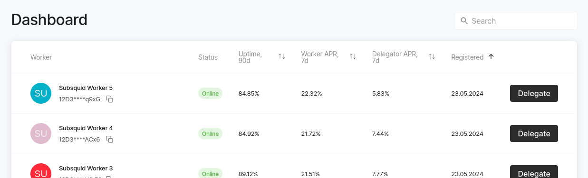
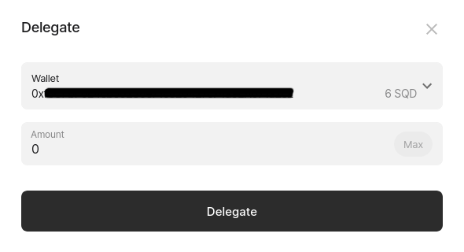
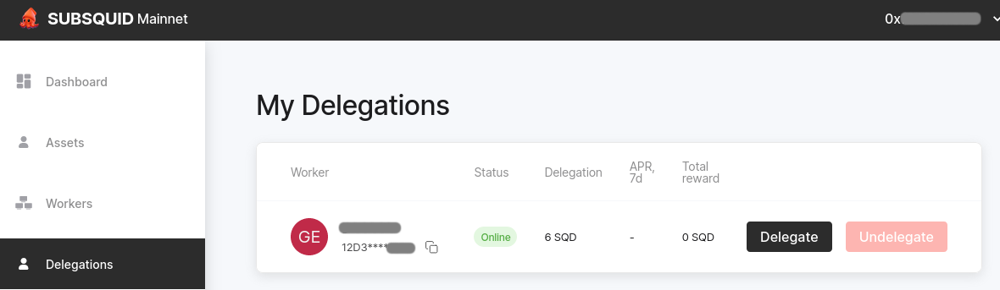
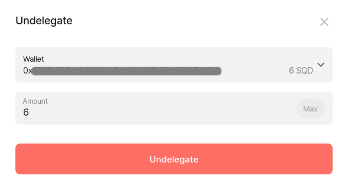

# Delegate

The easiest way to participate in SQD Network is to delegate your `SQD` tokens to one of the workers. Here's how to do it.

1. Go to [network.subsquid.io](https://network.subsquid.io).

2. Go to the "Dashboard" tab if you aren't there already. You should see something like this:

   

3. Pick a worker and press the "Delegate" button. You should see a form like this:

   

   Enter the amount of `SQD`s you'd like to delegate and press the button.

4. Confirm the transaction in your wallet and wait for it to go through.

5. Go to the "Delegate" tab to view your delegations. Note that the "Undelegate" button is inactive - you cannot undelegate until the current [epoch](/subsquid-network/faq/#epoch) ends.

   

## Undelegating

1. Go to [network.subsquid.io](https://network.subsquid.io).

2. Go to the "Delegate" tab. You should see your delegation there.

3. If you delegated recently, the "Undelegate" button might be inactive. This indicates that your delegation is not yet be available for withdrawal. Wait until the current [epoch](/subsquid-network/faq/#epoch) ends (should take up to ~20 minutes).

4. Once the "Undelegate" button is active, click it. You should see a form like this one:

   

5. Enter the `SQD` amount you want to withdraw, click the large new "Undelegate" button and confirm the transaction.

## Maximizing the rewards

- You'll get most rewards if you delegate to high quality but obscure workers. Look for workers with high uptime percentage and a lot of free delegation capacity.
- Currently, both the worker and its delegators are rewarded the most when the total delegated `SQD` count is around `30_000`. Anything more or less means less rewards.
