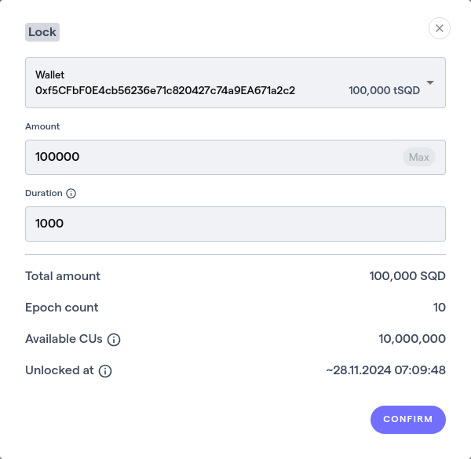
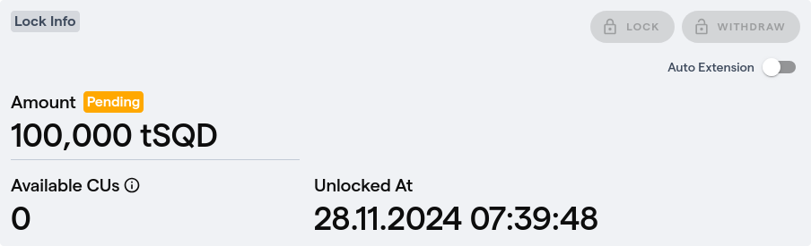
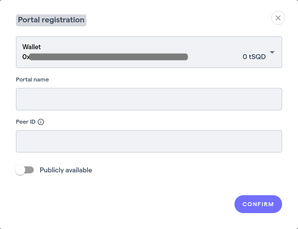

# Self-host a portal

:::info
SQD Network portals are currently in closed beta. Please report any bugs or suggestions to the SQD Portal chat or to [Squid Devs](https://t.me/HydraDevs).
:::

Running a portal enables you to access the [permissionless SQD Network](/subsquid-network/overview) data without relying on any centralized services. You can run a private portal for your own needs, or make a high-throughput public portal.

In either scenario you will need

* A working Docker installation
* 10000 or more `SQD` tokens
   + You won't have to spend the tokens, but you will need to keep them locked while you're using your portal. The more tokens you lock, the more bandwidth you get.
   + For the minimum amount of 10000 `SQD` you'll get enough bandwidth to run a few squids. If you expect heavier workloads, read the [Token requirements and compute units](#staking-requirements-and-compute-units) section to estimate the required sum.
   + The tokens can be in your wallet or in an SQD-issued vesting contract.
* Some Arbitrum ETH (for gas)

Portal hardware requirements:
 * at least 8Gb of unused RAM

The rest of the hardware requirements depend on how the portal will be used. A private portal with a single user can run on a laptop, provided that it has enough RAM.

## Setting up a portal {#portal-setup}

#### Step 1: Lock some SQD {#lock-sqd}

* Go to [network.subsquid.io](https://network.subsquid.io) and connect your wallet (we recommend Metamask). Use the wallet that holds the tokens or is the beneficiary of your vesting contract.
* Go to the [portals page](https://network.subsquid.io/portals) and press the "Lock" button.
  
* Specify the amount of `SQD` you want to lock and the duration of the lockup.
  
* Press "Confirm" then confirm the transaction in your wallet.

The page should update to display the amount of `SQD` you locked and the duration of the lockup:



Now you have some locked tokens associated with your wallet and are ready to set up the portal itself.

:::tip
By default, your portal will go down at the end of the lock period. To prevent that, click the "Auto Extension" switch and confirm the transaction after locking. This will cause your `SQD` to be immediately relocked once the locking period ends. In this setup you have to unlock then wait for the end of the current locking period to withdraw your tokens.


:::

#### Step 2: Generate a peer ID {#generate-peer-id}

SQD Network is a decentralized peer-to-peer system. Portals are a type of peers participating in it. Like all peers, your portal requires a private key and a public unique identifier: the *peer ID*. Generate one of these with
```bash
docker run --rm subsquid/rpc-node:0.2.5 keygen > <KEY_FILE_PATH>
```
The key will be written to the binary file at `<KEY_FILE_PATH>`. You will see your peer ID in the output:
```
Your peer ID: <THIS IS WHAT YOU NEED TO COPY>
```
Please copy your peer ID.

⚠️ **Note:** Please make sure that the generated file is safe and secure at `<KEY_FILE_PATH>` (i.e. it will not be deleted accidentally and cannot be accessed by unauthorized parties). [Or else](#key-loss).

#### Step 3: Register your portal {#register-peer-id}

* Go to the [portals page](https://network.subsquid.io/portals) and click the "Add portal" button.
  
* Fill the portal registration form.
  

  If you plan to make your portal public, click the "Publicly available" switch and populate the additional fields.
  

  Once done, click "Confirm" and confirm the transaction in your wallet.

#### Step 4: Run your portal {#run-portal}

* Clone the portal repo and enter the folder.
  ```bash
  git clone https://github.com/subsquid/sqd-portal
  cd sqd-portal
  ```
* Prepare the environment. Begin with
  ```bash
  cp mainnet.env .env
  ```
  then set the path to your key file:
  ```bash
  echo KEY_PATH=<KEY_FILE_PATH> >> .env
  ```

  ⚠️ **Warning:** Be careful when supplying the path to the key you created at step 4. If you make a mistake here, a new random key will be automatically created there and your node will attempt to operate with a new (unregistered) peer ID - unsuccessfully.

* Run your portal. You can either utilize a pre-built Docker image:
  ```bash
  docker compose up -d
  ```
  or build it from source:
  ```bash
  cargo run --release
  ```
  ⚠️  Tested on `cargo-1.82.0`; may not work on older versions.

  ⚠️  If you get a `Could not find protoc` error, please install the Protobuf compiler. E.g. on Ubuntu run
  ```bash
  apt-get install protobuf-compiler
  ```

* If you're running the Docker image you can watch the logs with
  ```bash
  docker compose logs -f
  ```

#### Step 5: Wait for your stake to become active

This will happen at the beginning of the next [epoch](/subsquid-network/faq/#epoch), that is, at some point during the next 20 minutes. The page will change to show that your lockup is now active:


## Using your portal

A working portal exposes its dataset-specific APIs via URLs such as this one:
```
http://<host>:8000/datasets/<dataset-slug>
```
Here, `<dataset-slug>` is the last path segment of the network-specific gateway URL found on [this page](/subsquid-network/reference/networks). For example, a local portal will expose its Ethereum dataset API at
```
http://127.0.0.1:8000/datasets/ethereum-mainnet
```

You can now get any squid (e.g. one of the [templates](/sdk/how-to-start/squid-development/#templates) or [examples](/sdk/examples)), tweak it to [source data from your portal](/subsquid-network/participate/portal) and run it.

## Token requirements and compute units {#staking-requirements-and-compute-units}

The minimum token locking requirement for a portal is 10000 `SQD`. This should be enough for simple user cases like running 2-3 squid or grabbing some data for analytics. If you expect heavier workloads, read on.

The rate limiting mechanism of SQD Network relies on the concept of a _compute unit_, or CU for short. CUs do not map directly to the amount of data fetched by a portal; instead, they (roughly) represent the amount of work that the network does internally while serving the portal's requests.

<details>
<summary>The definition of CU</summary>

SQD Network datasets are partitioned by the block number. Dataset chunks are randomly distributed among [worker nodes](/subsquid-network/participate/worker).

When an SQD portal receives a data request, the following happens:

1. The portal forwards the request to several workers that hold the chunks of the relevant dataset.

2. The workers are executing the request separately on each chunk.

3. Workers send the results back to the portal. For lightweight queries they send one response for each dataset chunk; however, if any response ends up being larger than 100 Mbytes, it's split into several parts.

4. The portal concatenates the workers' replies and serves a continuous stream of data to the user.

Each response made by any of the workers in step 3 spends exactly 1 CU.

</details>

The more `SQD` you lock and the greater the lockup period is, the more CUs you get. Currently, each locked `SQD` generates 1-3 CU at the beginning of each [epoch](/subsquid-network/faq/#epoch). Here's how the number of CUs per `SQD` changes with the lockup period:


In principle, any valid amount of locked `SQD`s generates an infinite amount of CUs. However, if the rate at which your queries consume CUs exceeds the rate at which they are produced, your app will be throttled. To avoid that, you may want to understand how much CUs your queries spend.

Currently there is no tool available for estimating the number of CUs that a query needs before actually running it. However, on EVM you can use the following formula to get an [order of magnitude](https://en.wikipedia.org/wiki/Order_of_magnitude) estimate:

```
10^-5 * range_length_blocks * transactions_per_block
```
Notes:
 - This assumes lightweight queries - that is, queries that fetch much less data than the total dataset size. For heavyweight queries multiply the estimate by a factor of 2-5.
 - This is a rough estimate. Multiply it by ten to get a somewhat safe figure. If you want to minimize your `SQD` lockup, start at that safe figure, then measure the actual amount of CU you spend and reduce the lockup accordingly.
 - If your network has an Etherscan-style explorer, you can estimate the `transactions_per_block` by visiting its front page, reading the "Transactions" stat and dividing it by the "Last finalized block" height.

<details>
<summary>How the estimate is made</summary>

For a lightweight query, the amount of CU spent on it is determined by how many dataset chunks the network needs to look at to process it. The ingester makes chunks of roughly the same size within each dataset. Since the amount of data per block is roughly proportional to the number of transactions in the said block, we can assume that the number of chunks in any given range is proportional to the number of transactions per block.

Extrapolating from the Ethereum dataset, we get
```
num_chunks_in_range = range_length * (eth_chunks / eth_height) * (chain_txs_per_block / eth_txs_per_block)
```
Here,
 - `eth_chunks` = 3.1e4
 - `eth_height` = 2.1e7
 - `eth_txs_per_block` = 1.2e2

Multiplying all the known values together and rounding to one decimal digit, we get the `1e-5` coefficient of the final formula.

The implicit assumption here is that all EVM datasets have the same chunk size as Ethereum. This does not hold: the chunk sizes vary, but are generally kept within the range of 50-1000 Mbytes. Ethereum chunk size is roughly 500 Mbytes; therefore we can expect the estimate to be off by a factor of 0.5-10, which is within the "order of magnitude" definition.

Heavyweight queries scale in the same way, but may spend more than one CU per chunk. The heaviest possible queries (fetching the whole dataset) on Ethereum consume roughly 5 CUs per chunk.

</details>

Now, if your queries consume `X` CUs each and you run them once per `Y` epochs, you need to lock up at least this much `SQD`:
```
X / (Y * boost_factor)
```
Here, `boost_factor` is a multiplier ranging from 1 to 3 depending on the lockup length (see the graph above).

#### Example

Suppose your query traverses the last 1M blocks of the Binance Smart Chain and you want to run it once every hour.

* Visiting [bscscan.com](https://bscscan.com) we find that there's a total of 6.4B txs made over 44M blocks. We can roughly estimate the chain density at 150 txs/block.
* We can now estimate the cost of each query to be on the order of `10^-5 * 10^6 * 150 = 1500` CU.
* When ran once every 60 minutes or 3 epochs at 20 min per epoch, such queries would require roughly `1500 / 3 = 500` `SQD` locked up. This assumes a short lockup (under 60 days).
* Finally we apply the recommended margins:
  + For lightweight queries it is 10x and the final sum amounts to 5000 `SQD` - less than the global minimum lockup of 10000.
  + If you're running extremely heavy queries, the recommended margin is 50x and the final recommended lockup is 25000 `SQD`. Use this value as a starting point and iterate if you'd like to minimize your lockup.
    - If you'd like to reduce the amount of `SQD` even further, one option is to lock the tokens up for longer: with a two-year long lockup heavy queries you'll get three times the CUs and the final recommended lockup will be 10000 even for heavy queries.

## High throughput portals

The recommended way to make a portal that can serve a large number of requests is deploy multiple portals associated with a single wallet:

1. Use a single wallet to register as many peer IDs as you need portal instances.

2. Make one `SQD` lockup for all your portal instances. See [Token locking requirements and compute units](#staking-requirements-and-compute-units) to get an idea of how large your stake should be.

3. Run portals in parallel, balancing traffic between the instances.

If you plan to automate running your portal instances, you may find [this helm chart](https://github.com/subsquid/sqd-portal/tree/master/chart) useful.

## Troubleshooting

#### What are the consequences of losing my key file / getting it stolen? {#key-loss}

If you lose your key file you won't be able to run your portal until you get a new one and register it.

If your key file get stolen the perpetrator will be able to cause connectivity issues for your portal, effectively causing a downtime.

If any of that happens, unregister your portal (on the ["Portals" tab of network.subsquid.io](https://network.subsquid.io/portals)), then generate a new key file and register the new portal peer ID.

#### My portal is slower than I expected. How do I examine its throttling stats?

The stats are exposed at `/metrics`. For a local portal, take a look at the output of
```
curl http://127.0.0.1:8000/metrics | grep throttled
```
The lower the value of `portal_stream_throttled_ratio_sum`, the better.
