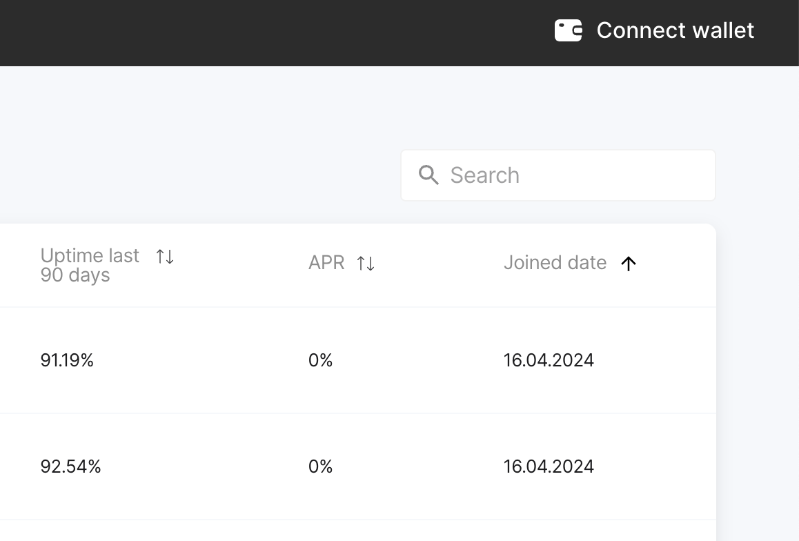
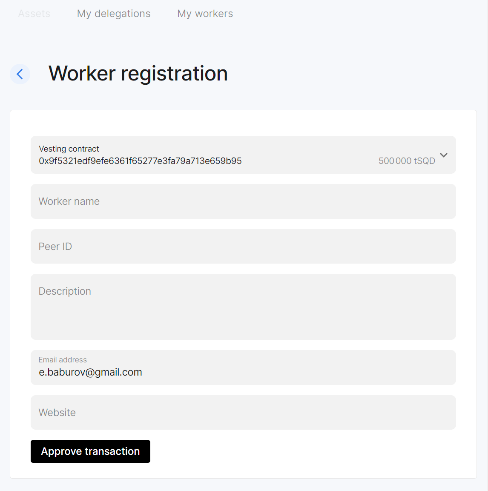

# Run a worker

## Requirements

:::danger
We strongly advise against using Hetzner for running Subsquid Network nodes.
:::

To run a single worker you'll need:

* 4 vCPU
* 16GB RAM
* 1TB SSD
* stable 24/7 Internet connection, at least 1Gbit
* a public IP and two ports open for incoming traffic:
  - one UDP port for p2p communication (default 12345)
  - one TCP port for Prometheus metrics (default 9090)
* Docker + Docker Compose
* `100_000` `SQD` tokens (in your wallet or in a special vesting contract)
* some Arbitrum ETH (for gas)

The `SQD` tokens should be available to your _Primary Wallet_ - either directly or through a vesting contract. With enough funds you can use one Primary Wallet to register multiple workers.

Your Primary Wallet should have browser support. We recommend Metamask.

You can run a worker from a Docker image or from its source code. Note that you'll need Docker either way, as our configuration script uses it.

## Configuring your setup {#configuration}

1. Pick a location for worker data. It should be able to accommodate at least 1Tb. Do not create the data folder manually, just find a place for it.

2. Pick a location for your SQD Network key file. The location must be outside of the data directory.

   ⚠️  **Warning:** Ensure that that the key will not be deleted accidentally and cannot be accessed by unauthorized parties. [Or else](#key-loss).
3. Create a new directory for installation files and save the [`setup_worker.sh`](https://cdn.subsquid.io/worker/setup_worker.sh) script in it:
   ```bash
   curl -fO https://cdn.subsquid.io/worker/setup_worker.sh
   ```
   Make the script executable:
   ```bash
   chmod +x ./setup_worker.sh
   ```

4. Run the setup script. Supply the data directory path and the key path to it:
   ```bash
   ./setup_worker.sh <DATA_DIR_PATH> <KEY_PATH>
   ```
   The script will prompt you for an UDP port to use for P2P communication and give you an option to set your public IP address in worker config statically. *Most users should not set the IP address here* since setups with automatic IP discovery are more robust.

   Here's what the script does:
    - creates a directory at `<DATA_DIR_PATH>`
    - generates a key file at `<KEY_PATH>`
    - generates a `.env` file in the current directory and populates it with reasonable defaults
    - downloads a `.mainnet.env` file
    - downloads a `docker-compose.yaml` file for running prebuilt worker images

   You can take a look at the files that the script downloads [here](https://github.com/subsquid/cdn/tree/main/src/worker).

   The last line of the script's output should look like this:
   ```
   Your peer ID is: 12D3KooWPfotj6qQapKeWg4RZysUjEeswLEpiSjgv16LgNTyYFTW. Now you can register it on chain.
   ```
   *Please copy your peer ID*, as it will be needed for [on-chain worker registration](#registration).

5. (optional) Feel free to edit the generated `.env` and `.mainnet.env` files if you'd like, e.g., to set a custom Prometheus port or use your own RPC provider.

Proceed to [Worker registration](#registration).

## Worker registration {#registration}

:::info
By registering a worker you're committing your tokens for a period of 50000 Ethereum blocks (a bit less than seven days) + the time until the end of the current [epoch](/subsquid-network/faq/#epoch) (20 minutes or less). Withdrawal will not be possible during that time.
:::

Before you run a worker node, you need to register it on-chain using our web application. Here are the steps to do this:

1. Go to [https://network.subsquid.io](https://network.subsquid.io).

2. Connect your Primary Wallet.

   

3. Go to the Workers tab and press the "Add Worker" button. You should see a worker registration form:

   

4. Fill the form and submit it by signing a transaction:
   - In the top drop down menu, choose either "Wallet" (to use `SQD`s from your wallet directly) or "Vesting contract" (to use `SQD`s from a vesting contract).
   - Use the peer ID you copied at step 4 of [Configuring your setup](#configuration).

5. Go to the "Workers" tab and wait until the status of the registered worker changes to "Offline" or "Active". Since workers can only be activated at the beginning of an [epoch](/subsquid-network/faq/#epoch), you may have to wait for a few minutes.

Proceed to [Running a worker](#running).

## Running a worker {#running}

Make sure you're still in the folder where you executed `setup_worker.sh` during [configuration](#configuration) before proceeding.

### Using a pre-built Docker image

Run
```bash
docker compose up -d
```
then check the logs of the worker container with `docker compose logs`. After some time the worker should output some info on the downloaded data chunks.

### Building from the source

1. Install prerequisites (Rust, Git, Protobuf, etc), e.g. with

    ```bash
    apt install curl git build-essential pkg-config protobuf-compiler libssl-dev libsqlite3-dev
    curl --proto '=https' --tlsv1.2 -sSf https://sh.rustup.rs | sh
    ```

2. Load the config generated during the [setup](#configuration).
    ```bash
    source .mainnet.env
    source .env
    ```

3. Clone the worker repo.
   ```bash
   git clone --depth 1 --branch v1.0.0 https://github.com/subsquid/worker-rs.git
   ```
   This may take a few minutes.

4. Build the worker.

    ```bash
    cd worker-rs
    cargo build --release
    ```

5. Run the worker using the command below. It uses `nohup`, but you may also consider daemonizing it with `systemd` or `openrc` to tolerate server restarts.

    ```bash
    nohup cargo run --release -- --port $PROMETHEUS_PORT p2p
    ```

6. After some time the worker should start downloading data and serving queries.

## Updating a worker

Sometimes you will need to update your worker. Here's the default procedure:

1. Back up your key file.

2. If you are running a docker image:
   - go to your installation files folder
   - fetch the updated `docker-compose.yaml`:
     ```bash
     curl -fO https://cdn.subsquid.io/worker/docker-compose.yaml
     ```
   - run
     ```bash
     docker compose up
     ```
     to apply the update.

3. If you're running a binary built from source:
   - note the new worker version in the announcement
   - go to your installation files folder
   - enter the `worker-rs` subfolder
   - fetch the new commits:
     ```bash
     git fetch --unshallow
     ```
   - check out the new worker version:
     ```bash
     git checkout <new_version_tag>
     ```
   - rebuild the worker:
     ```bash
     cargo build --release
     ```
   - restart the worker process

No need to erase the data folder or re-register your worker.

Some releases may require that you deviate from this procedure, so please read release notes carefully.

## On jailing

Jailing is a scheduler-side mechanism that ensures that every data chunk is available for querying. The scheduler tries to predict which workers are "unreliable" and makes the best effort to guarantee that each chunk is available on at least several "reliable" worker nodes.
However, even if a worker is marked as unreliable, it continues serving queries from the chunks it had downloaded and getting the rewards. And it's only temporary — the worker will get unjailed automatically within ~3 hours. If the reason for jailing is gone, it won't be jailed next time.

If the worker constantly gets jailed, it may affect its rewards, so it shouldn't be ignored. There are multiple reasons why the worker can be marked as unreliable (see worker's logs to find out which one applies):

- **Worker didn't download any of the assigned chunks in last 900 seconds** (`stale` in our internal terminology) — this one is the most popular. The cause of the problem should be found in the worker's logs. The most probable one is the [download timeouts](#download-timeouts).
- **Worker didn't send pings for over 600 seconds** (`inactive`) — it may occur for example when a worker got back after a long downtime. If the scheduler doesn't receive pings from the worker, it considers it offline and doesn't assign any chunks to it.
- **Worker could not be reached on a public address** (`unreachable`). This was our attempt to determine which nodes are not reachable through the p2p network, but the correct implementation turned out harder than it seemed, so it is disabled right now.

## Troubleshooting

#### Where do I find my peer ID ?

It is printed when you run `setup_worker.sh` (see [Configuring your setup](#configuration)).

It is also in the first line of the worker log output. For the docker setup, inspect the worker container logs with `docker compose logs`.

If you installed your worker from source, check the `network.log` file.

In both cases, the log line you are looking for should look like this

```
2024-05-28T07:43:55.591440Z  INFO subsquid_worker::transport::p2p: Local peer ID: <PEER_ID>
```

[//]: # (### How do I get `SQD` tokens ?)

#### I see `Failed to download chunk ... operation timed out` in the worker logs {#download-timeouts}

Depending on your connection quality, you might want to tune the `S3_TIMEOUT` and `CONCURRENT_DOWNLOADS` environment variables in the `.env` file. If you encounter this error frequently,  try to set `S3_TIMEOUT` to `180`. If it still doesn't help, set `CONCURRENT_DOWNLOADS` to `1` and `S3_READ_TIMEOUT` to `30`.

#### I see `Unable to get assignment: deadline has elapsed` in the worker logs {#assignment-timeouts}

This should only be an issue on version 2.0.2. As a workaround please set `ASSIGNMENT_FETCH_TIMEOUT_SEC=90` in the `.env` file and restart.

#### I see an `Insufficient peers...` error in the worker logs

Just ignore it

#### Can I move my worker to another server?

Yes, copy the key file (at `<KEY_PATH>`) to the new working directory before starting. You don't need to re-register your worker. Don't forget to update the data directory on the new server.

#### I have just started my worker but see no logs

This is normal. Wait for a few minutes and the logs should show some data being downloaded.

#### Should I build it from source or run with Docker?

Docker makes for an easier setup. Building from sources is suitable only for experienced Linux/Unix users.

#### How do I check that my worker is updated to the latest version?

Check the [pings endpoint](https://scheduler.mainnet.subsquid.io/workers/pings) and locate the version by your peer ID.

#### Which Linux distro is recommended?

We recommend Ubuntu 22.04 LTS.

#### I see `error from daemon in stream: Error grabbing logs`

This is a Docker issue, not a problem with the worker. Look at [this GitHub issue](https://github.com/docker/for-linux/issues/140) and [this Stackoverflow thread](https://stackoverflow.com/questions/46843711/docker-error-grabbing-logs-invalid-character-x00-looking-for-beginning-of-v) for more context.

#### How do I check if my worker is up-to-date and running?

Copy your peer ID and look for an entry on [this page](https://scheduler.mainnet.subsquid.io/workers/pings). If the last ping timestamp is 1 minute ago, and the listed version is the most recent one, you should be good.

#### I'm getting `Clone succeeded, but checkout failed` when cloning the worker repo

Enter the repo folder and check out v1.0.0 manually:
```bash
cd worker-rs
git checkout v1.0.0
```

#### What are the consequences of losing my key file / getting it stolen? {#key-loss}

If you lose your key file you won't be able to run your worker until you get a new one and register it.

If your key file gets stolen the perpetrator will be able to cause connectivity issues for your worker.

If any of that happens, unregister your worker (on the ["Workers" tab of network.subsquid.io](https://network.subsquid.io/workers)), [generate](#configuration) a new key file and [register](#registration) your new peer ID.
