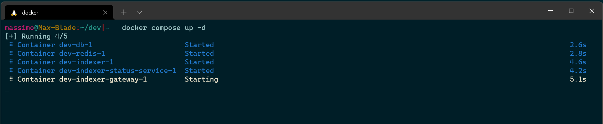

# How to launch an Archive

## Overview

This quick Recipe covers how to launch an Archive for a blockchain that is already covered by Subsquid and how to run one for a new blockchain.

### Requirements

In order to run an Archive, it is required to have Docker installed. For a quick installation guide, head over to [the dedicated page](../tutorial/development-environment-set-up.md#docker).

## Squid Archive repository

Launching an Archive is as easy as visiting our [dedicated Archive setup repository](https://github.com/subsquid/squid-archive-setup) and checking if the blockchain you want to synchronize is listed. Let's say Equilibrium, in the context of this example.


If that is the case, simply clone the repository

```
git clone git@github.com:subsquid/squid-archive-setup.git
```

### Launch the Archive locally

Navigate to the corresponding folder in a command line console window and run

```
docker-compose up -d
```


The -d parameter is advised to avoid locking the console window and being flooded by log messages.




To check that everything went well and verify the ports, launch the following command

```bash
docker container ls
```

The result should look like this (you could have more entries, if you launched other containers in a separate context):


Now the last check to perform is visit the console, by typing this URL `http://localhost:4010/console` in a browser.

### Use local Archive in a Squid API

In order for a Squid API to use the Archive we just launched locally, it is necessary to change the values in the `setDataSource` function call, typically in the `processor.ts` file (if the project was not differently customized). The `archive` value should be set to `http://localhost:4010/v1/graphql`:


```typescript
// ...

processor.setDataSource({
  archive: "http://localhost:4010/v1/graphql",
  chain: "<insert chain WSS URL here>",
});

// ...
```


### Running in production environment

The provided docker compose setup is a minimal configuration best suitable for dev and testing environments. For a stable production deployment we recommend the following.

* Use a private gRPC endpoint (`WS_PROVIDER_ENDPOINT_URI` env variable in the docker file)
* Use managed Postgres database with non-root access (`DB_*` env variables in the docker file)
* Collect and monitor [Prometheus](https://prometheus.io/) metrics exposed at port 9090
* Increase `WORKERS_NUMBER` environment variable to speed up the syncing. Usually somewhere between 5-50 workers is a sweet spot depending on the gRPC endpoint capacity.

To reliably run an Archive we recommend 16GB RAM and modern CPU. Database storage requirements depend on the size of the network. A rule of thumb is to reserve around 100 kb per block, so e.g. for Kusama with \~10M blocks one needs about 1Tb for Postgres storage.

## Caveats for 🍏 M1 Macs

A [known issue](https://github.com/subsquid/squid/issues/21) prevents M1 Macs from running the console. Possible workaround:

1. [Clone subsquid/hydra repo](https://github.com/subsquid/hydra)
2. checkout v5 branch
3. build the gateway image with:

```
./scripts/docker-build.sh --target indexer-gateway -t subsquid/hydra-indexer-gateway:5
```

After that, you can run docker-compose as usual.

## Launch an Archive for a new blockchain

If a specific blockchain is not listed in the repository, it is possible to add it by contributing to the repository itself, following these steps:

1. Fork the repository
2. Create a folder dedicated to the new blockchain
3. Copy one of the `docker-compose.yml` file from another folder&#x20;
   * Edit the `WS_PROVIDER_ENDPOINT_URI` environment variable to the correct endpoint for the given chain
   * Make sure to create a types bundle file named as the one mentioned in the `BUNDLE_TYPES` environment variable (see next point)
4. The Archive needs to know which types the blockchain Runtime is using, and to instruct it, a types bundle JSON file needs to be passed in.
   * To know how to create such a file for a given chain, head over to [our dedicated page](../faq/where-do-i-get-a-type-bundle-for-my-chain.md)
5. Create a pull-request towards the main repository

### Launch Archives for EVM-compatible blockchain

In the case of an EVM-compatible blockchain, you'd want to fully leverage the native support for EVM logs to process contracts, by making sure that the Archive is extracting that data from the blockchain itself.

To do so, simply follow the procedure above, but make sure to check that the images for the `indexer` and `indexer-gateway` are, respectively:

* `subsquid/hydra-evm-indexer:5`
* &#x20;`subsquid/hydra-evm-indexer-gateway:5`

Like so:


```yaml
version: "3.4"
services:
  db:
    image: postgres:12
    restart: always
    volumes:
      - /var/lib/postgresql/data
    environment:
      POSTGRES_USER: postgres
      POSTGRES_PASSWORD: postgres
  indexer:
    image: subsquid/hydra-evm-indexer:5
    restart: unless-stopped
    environment:
      - WORKERS_NUMBER=5
      - DB_NAME=indexer
      - DB_HOST=db
      - DB_USER=postgres
      - DB_PASS=postgres
      - DB_PORT=5432
      - REDIS_URI=redis://redis:6379/0
      - BLOCK_HEIGHT=0 # starting block height
      - FORCE_HEIGHT=true
      - WS_PROVIDER_ENDPOINT_URI= # chain WSS
    depends_on:
      - db
      - redis
    command: >
      sh -c "yarn db:bootstrap && yarn start:prod"
    ports:
      - 9090:9090
  indexer-gateway:
    image: subsquid/hydra-evm-indexer-gateway:5
    restart: unless-stopped
    depends_on:
      - redis
      - db
      - indexer-status-service
      - indexer
    ports:
      - "4010:8080"
    environment:
      - DEV_MODE=true
      - DB_NAME=indexer
      - DB_HOST=db
      - DB_USER=postgres
      - DB_PASS=postgres
      - DB_PORT=5432
      - HYDRA_INDEXER_STATUS_SERVICE=http://indexer-status-service:8081/status
  indexer-status-service:
    image: subsquid/hydra-indexer-status-service:5
    restart: unless-stopped
    depends_on:
      - redis
    environment:
      REDIS_URI: redis://redis:6379/0
      PORT: 8081
  redis:
    image: redis:6.0-alpine
    restart: always
    ports:
      - "6379"
```

